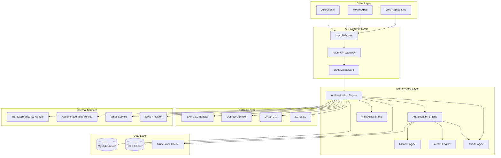
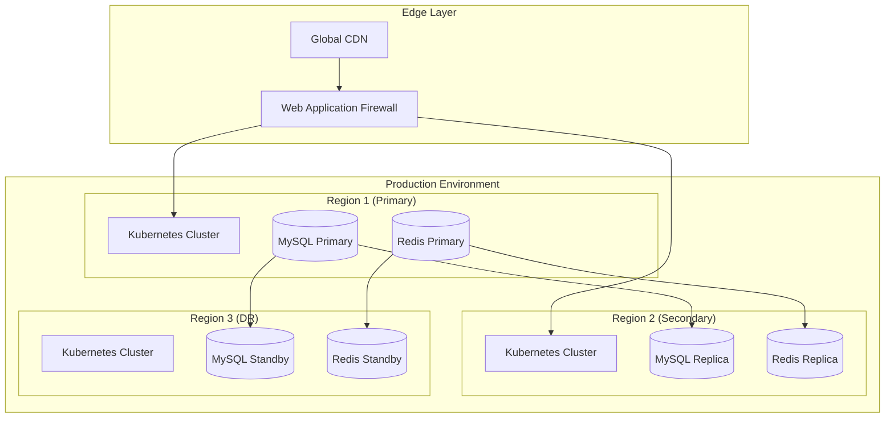

# Design Document: Enterprise SSO Platform

## Overview

This document outlines the design for a production-ready, MNC-grade Rust Single Sign-On (SSO) and Identity Platform. The system is architected to support 100k-1M+ concurrent users across multiple websites with enterprise-grade security, compliance, and scalability requirements.

The platform implements a microservices architecture with clear separation between the Identity Core (pure business logic) and API Gateway (HTTP layer), ensuring maintainability and testability while supporting dynamic configuration of roles, permissions, and subscription plans.

## Architecture

### High-Level Architecture



### Microservices Architecture

The system follows a domain-driven design with clear service boundaries:

1. **Identity Service**: Core authentication and user management
2. **Authorization Service**: RBAC/ABAC policy evaluation
3. **Federation Service**: SAML/OIDC/OAuth protocol handling
4. **Risk Service**: ML-based risk assessment and fraud detection
5. **Audit Service**: Compliance logging and reporting
6. **Configuration Service**: Dynamic configuration management
7. **Billing Service**: Subscription and usage tracking

### Deployment Architecture



## Components and Interfaces

### Core Components

#### 1. Identity Core (`core/identity.rs`)

```rust
pub struct IdentityService {
    credential_engine: CredentialEngine,
    token_engine: TokenEngine,
    risk_engine: RiskEngine,
    audit_engine: AuditEngine,
}

pub trait IdentityProvider {
    async fn authenticate(&self, request: AuthRequest) -> Result<AuthResponse>;
    async fn create_user(&self, user: CreateUserRequest) -> Result<User>;
    async fn get_user(&self, user_id: UserId, tenant_id: TenantId) -> Result<User>;
    async fn update_user(&self, user: UpdateUserRequest) -> Result<User>;
    async fn delete_user(&self, user_id: UserId, tenant_id: TenantId) -> Result<()>;
}
```

#### 2. Authorization Engine (`core/rbac.rs`, `core/abac.rs`)

```rust
pub struct AuthorizationEngine {
    rbac_engine: RbacEngine,
    abac_engine: AbacEngine,
    policy_engine: PolicyEngine,
}

pub trait AuthorizationProvider {
    async fn authorize(&self, context: AuthzContext) -> Result<AuthzDecision>;
    async fn create_role(&self, role: CreateRoleRequest) -> Result<Role>;
    async fn assign_role(&self, assignment: RoleAssignment) -> Result<()>;
    async fn evaluate_policy(&self, policy: Policy, context: Context) -> Result<Decision>;
}
```

#### 3. Token Management (`core/tokens.rs`)

```rust
pub struct TokenEngine {
    jwt_service: JwtService,
    refresh_service: RefreshTokenService,
    session_manager: SessionManager,
}

pub trait TokenProvider {
    async fn issue_access_token(&self, claims: Claims) -> Result<AccessToken>;
    async fn issue_refresh_token(&self, user_id: UserId) -> Result<RefreshToken>;
    async fn validate_token(&self, token: &str) -> Result<Claims>;
    async fn revoke_token(&self, token_id: TokenId) -> Result<()>;
    async fn refresh_tokens(&self, refresh_token: &str) -> Result<TokenPair>;
}
```

### Protocol Handlers

#### SAML 2.0 Handler (`security/saml.rs`)

```rust
pub struct SamlHandler {
    metadata_service: MetadataService,
    assertion_service: AssertionService,
    signature_service: SignatureService,
}

pub trait SamlProvider {
    async fn handle_sso_request(&self, request: SamlRequest) -> Result<SamlResponse>;
    async fn handle_slo_request(&self, request: SloRequest) -> Result<SloResponse>;
    async fn generate_metadata(&self, tenant_id: TenantId) -> Result<Metadata>;
}
```

#### OpenID Connect Handler (`security/oidc.rs`)

```rust
pub struct OidcHandler {
    discovery_service: DiscoveryService,
    authorization_service: AuthorizationService,
    token_service: TokenService,
    userinfo_service: UserinfoService,
}

pub trait OidcProvider {
    async fn handle_authorization(&self, request: AuthzRequest) -> Result<AuthzResponse>;
    async fn handle_token(&self, request: TokenRequest) -> Result<TokenResponse>;
    async fn handle_userinfo(&self, token: AccessToken) -> Result<UserinfoResponse>;
    async fn get_discovery_document(&self) -> Result<DiscoveryDocument>;
}
```

### API Layer Interfaces

#### HTTP Handlers (`api/handlers.rs`)

```rust
pub async fn login_handler(
    State(app_state): State<AppState>,
    Json(request): Json<LoginRequest>,
) -> Result<Json<LoginResponse>, ApiError>;

pub async fn logout_handler(
    State(app_state): State<AppState>,
    claims: Claims,
) -> Result<Json<LogoutResponse>, ApiError>;

pub async fn refresh_handler(
    State(app_state): State<AppState>,
    Json(request): Json<RefreshRequest>,
) -> Result<Json<TokenResponse>, ApiError>;
```

#### Middleware (`api/middleware.rs`)

```rust
pub struct AuthMiddleware {
    token_service: Arc<dyn TokenProvider>,
    config: AuthConfig,
}

impl<S> Layer<S> for AuthMiddleware {
    type Service = AuthService<S>;
    
    fn layer(&self, inner: S) -> Self::Service {
        AuthService::new(inner, self.token_service.clone())
    }
}
```

## Data Models

### Advanced Database Schema

The database schema supports horizontal sharding, multi-tenancy, and dynamic configuration:

#### Core Identity Tables

```sql
-- Organizations (top-level entities)
CREATE TABLE organizations (
    id CHAR(36) PRIMARY KEY,
    name VARCHAR(255) NOT NULL,
    domain VARCHAR(255) UNIQUE,
    status ENUM('active', 'suspended', 'deleted') DEFAULT 'active',
    settings JSON,
    created_at TIMESTAMP DEFAULT CURRENT_TIMESTAMP,
    updated_at TIMESTAMP DEFAULT CURRENT_TIMESTAMP ON UPDATE CURRENT_TIMESTAMP,
    INDEX idx_org_domain (domain),
    INDEX idx_org_status (status)
);

-- Tenants (organizational units within organizations)
CREATE TABLE tenants (
    id CHAR(36) PRIMARY KEY,
    organization_id CHAR(36) NOT NULL,
    name VARCHAR(255) NOT NULL,
    slug VARCHAR(100) NOT NULL,
    custom_domain VARCHAR(255),
    branding_config JSON,
    auth_config JSON,
    compliance_config JSON,
    status ENUM('active', 'suspended', 'deleted') DEFAULT 'active',
    created_at TIMESTAMP DEFAULT CURRENT_TIMESTAMP,
    updated_at TIMESTAMP DEFAULT CURRENT_TIMESTAMP ON UPDATE CURRENT_TIMESTAMP,
    FOREIGN KEY (organization_id) REFERENCES organizations(id),
    UNIQUE KEY uk_tenant_org_slug (organization_id, slug),
    INDEX idx_tenant_domain (custom_domain),
    INDEX idx_tenant_status (status)
);

-- Users with enhanced security fields
CREATE TABLE users (
    id CHAR(36) PRIMARY KEY,
    email VARCHAR(255) NOT NULL,
    email_verified BOOLEAN DEFAULT FALSE,
    phone VARCHAR(20),
    phone_verified BOOLEAN DEFAULT FALSE,
    password_hash VARCHAR(255),
    password_changed_at TIMESTAMP,
    failed_login_attempts INT DEFAULT 0,
    locked_until TIMESTAMP NULL,
    last_login_at TIMESTAMP NULL,
    last_login_ip VARCHAR(45),
    mfa_enabled BOOLEAN DEFAULT FALSE,
    mfa_secret VARCHAR(255),
    backup_codes JSON,
    risk_score DECIMAL(3,2) DEFAULT 0.00,
    profile_data JSON,
    preferences JSON,
    status ENUM('active', 'suspended', 'deleted', 'pending_verification') DEFAULT 'pending_verification',
    created_at TIMESTAMP DEFAULT CURRENT_TIMESTAMP,
    updated_at TIMESTAMP DEFAULT CURRENT_TIMESTAMP ON UPDATE CURRENT_TIMESTAMP,
    deleted_at TIMESTAMP NULL,
    UNIQUE KEY uk_email (email),
    INDEX idx_user_phone (phone),
    INDEX idx_user_status (status),
    INDEX idx_user_risk (risk_score),
    INDEX idx_user_deleted (deleted_at)
);

-- User-Tenant relationships with roles
CREATE TABLE user_tenants (
    user_id CHAR(36),
    tenant_id CHAR(36),
    status ENUM('active', 'suspended', 'pending') DEFAULT 'pending',
    joined_at TIMESTAMP DEFAULT CURRENT_TIMESTAMP,
    last_accessed_at TIMESTAMP NULL,
    PRIMARY KEY (user_id, tenant_id),
    FOREIGN KEY (user_id) REFERENCES users(id) ON DELETE CASCADE,
    FOREIGN KEY (tenant_id) REFERENCES tenants(id) ON DELETE CASCADE,
    INDEX idx_ut_tenant (tenant_id),
    INDEX idx_ut_status (status)
);
```

#### Dynamic RBAC Schema

```sql
-- Dynamic roles with hierarchical support
CREATE TABLE roles (
    id CHAR(36) PRIMARY KEY,
    tenant_id CHAR(36),
    name VARCHAR(100) NOT NULL,
    description TEXT,
    parent_role_id CHAR(36) NULL,
    is_system_role BOOLEAN DEFAULT FALSE,
    permissions JSON,
    constraints JSON,
    created_at TIMESTAMP DEFAULT CURRENT_TIMESTAMP,
    updated_at TIMESTAMP DEFAULT CURRENT_TIMESTAMP ON UPDATE CURRENT_TIMESTAMP,
    FOREIGN KEY (tenant_id) REFERENCES tenants(id) ON DELETE CASCADE,
    FOREIGN KEY (parent_role_id) REFERENCES roles(id) ON DELETE SET NULL,
    UNIQUE KEY uk_role_tenant_name (tenant_id, name),
    INDEX idx_role_parent (parent_role_id),
    INDEX idx_role_system (is_system_role)
);

-- Granular permissions
CREATE TABLE permissions (
    id CHAR(36) PRIMARY KEY,
    code VARCHAR(100) UNIQUE NOT NULL,
    name VARCHAR(255) NOT NULL,
    description TEXT,
    resource_type VARCHAR(100),
    action VARCHAR(100),
    conditions JSON,
    created_at TIMESTAMP DEFAULT CURRENT_TIMESTAMP,
    INDEX idx_perm_code (code),
    INDEX idx_perm_resource (resource_type),
    INDEX idx_perm_action (action)
);

-- Role-Permission mappings
CREATE TABLE role_permissions (
    role_id CHAR(36),
    permission_id CHAR(36),
    granted BOOLEAN DEFAULT TRUE,
    conditions JSON,
    created_at TIMESTAMP DEFAULT CURRENT_TIMESTAMP,
    PRIMARY KEY (role_id, permission_id),
    FOREIGN KEY (role_id) REFERENCES roles(id) ON DELETE CASCADE,
    FOREIGN KEY (permission_id) REFERENCES permissions(id) ON DELETE CASCADE
);

-- User-Role assignments with temporal support
CREATE TABLE user_roles (
    id CHAR(36) PRIMARY KEY,
    user_id CHAR(36),
    tenant_id CHAR(36),
    role_id CHAR(36),
    granted_by CHAR(36),
    granted_at TIMESTAMP DEFAULT CURRENT_TIMESTAMP,
    expires_at TIMESTAMP NULL,
    revoked_at TIMESTAMP NULL,
    revoked_by CHAR(36) NULL,
    FOREIGN KEY (user_id) REFERENCES users(id) ON DELETE CASCADE,
    FOREIGN KEY (tenant_id) REFERENCES tenants(id) ON DELETE CASCADE,
    FOREIGN KEY (role_id) REFERENCES roles(id) ON DELETE CASCADE,
    FOREIGN KEY (granted_by) REFERENCES users(id),
    FOREIGN KEY (revoked_by) REFERENCES users(id),
    INDEX idx_ur_user_tenant (user_id, tenant_id),
    INDEX idx_ur_role (role_id),
    INDEX idx_ur_expires (expires_at),
    INDEX idx_ur_active (revoked_at, expires_at)
);
```

#### Token and Session Management

```sql
-- Enhanced refresh tokens with family tracking
CREATE TABLE refresh_tokens (
    id CHAR(36) PRIMARY KEY,
    user_id CHAR(36) NOT NULL,
    tenant_id CHAR(36) NOT NULL,
    token_family CHAR(36) NOT NULL,
    token_hash VARCHAR(255) NOT NULL,
    device_fingerprint VARCHAR(255),
    user_agent TEXT,
    ip_address VARCHAR(45),
    expires_at TIMESTAMP NOT NULL,
    revoked_at TIMESTAMP NULL,
    revoked_reason VARCHAR(100) NULL,
    created_at TIMESTAMP DEFAULT CURRENT_TIMESTAMP,
    FOREIGN KEY (user_id) REFERENCES users(id) ON DELETE CASCADE,
    FOREIGN KEY (tenant_id) REFERENCES tenants(id) ON DELETE CASCADE,
    INDEX idx_rt_user (user_id),
    INDEX idx_rt_family (token_family),
    INDEX idx_rt_expires (expires_at),
    INDEX idx_rt_active (revoked_at, expires_at)
);

-- Cross-domain sessions
CREATE TABLE sessions (
    id CHAR(36) PRIMARY KEY,
    user_id CHAR(36) NOT NULL,
    tenant_id CHAR(36) NOT NULL,
    session_token VARCHAR(255) UNIQUE NOT NULL,
    device_fingerprint VARCHAR(255),
    user_agent TEXT,
    ip_address VARCHAR(45),
    risk_score DECIMAL(3,2) DEFAULT 0.00,
    last_activity TIMESTAMP DEFAULT CURRENT_TIMESTAMP,
    expires_at TIMESTAMP NOT NULL,
    created_at TIMESTAMP DEFAULT CURRENT_TIMESTAMP,
    FOREIGN KEY (user_id) REFERENCES users(id) ON DELETE CASCADE,
    FOREIGN KEY (tenant_id) REFERENCES tenants(id) ON DELETE CASCADE,
    INDEX idx_session_user (user_id),
    INDEX idx_session_token (session_token),
    INDEX idx_session_expires (expires_at),
    INDEX idx_session_activity (last_activity)
);
```

#### Dynamic Subscription and Feature Management

```sql
-- Dynamic feature plans
CREATE TABLE feature_plans (
    id CHAR(36) PRIMARY KEY,
    name VARCHAR(100) NOT NULL,
    description TEXT,
    billing_model ENUM('per_user', 'per_api_call', 'feature_based', 'hybrid') DEFAULT 'per_user',
    price_per_unit DECIMAL(10,2),
    currency CHAR(3) DEFAULT 'USD',
    features JSON NOT NULL,
    quotas JSON NOT NULL,
    is_active BOOLEAN DEFAULT TRUE,
    created_at TIMESTAMP DEFAULT CURRENT_TIMESTAMP,
    updated_at TIMESTAMP DEFAULT CURRENT_TIMESTAMP ON UPDATE CURRENT_TIMESTAMP,
    INDEX idx_plan_active (is_active),
    INDEX idx_plan_billing (billing_model)
);

-- Tenant subscriptions
CREATE TABLE tenant_subscriptions (
    id CHAR(36) PRIMARY KEY,
    tenant_id CHAR(36) NOT NULL,
    plan_id CHAR(36) NOT NULL,
    status ENUM('active', 'suspended', 'cancelled', 'expired') DEFAULT 'active',
    billing_cycle ENUM('monthly', 'yearly', 'usage_based') DEFAULT 'monthly',
    current_period_start TIMESTAMP NOT NULL,
    current_period_end TIMESTAMP NOT NULL,
    usage_data JSON,
    metadata JSON,
    created_at TIMESTAMP DEFAULT CURRENT_TIMESTAMP,
    updated_at TIMESTAMP DEFAULT CURRENT_TIMESTAMP ON UPDATE CURRENT_TIMESTAMP,
    FOREIGN KEY (tenant_id) REFERENCES tenants(id) ON DELETE CASCADE,
    FOREIGN KEY (plan_id) REFERENCES feature_plans(id),
    INDEX idx_ts_tenant (tenant_id),
    INDEX idx_ts_plan (plan_id),
    INDEX idx_ts_status (status),
    INDEX idx_ts_period (current_period_end)
);

-- Usage tracking for billing
CREATE TABLE usage_metrics (
    id CHAR(36) PRIMARY KEY,
    tenant_id CHAR(36) NOT NULL,
    metric_type VARCHAR(100) NOT NULL,
    metric_value BIGINT NOT NULL,
    recorded_at TIMESTAMP DEFAULT CURRENT_TIMESTAMP,
    billing_period CHAR(7) NOT NULL, -- YYYY-MM format
    metadata JSON,
    FOREIGN KEY (tenant_id) REFERENCES tenants(id) ON DELETE CASCADE,
    INDEX idx_um_tenant_period (tenant_id, billing_period),
    INDEX idx_um_type (metric_type),
    INDEX idx_um_recorded (recorded_at)
);
```

#### Comprehensive Audit Schema

```sql
-- Enhanced audit logs with compliance support
CREATE TABLE audit_logs (
    id CHAR(36) PRIMARY KEY,
    event_id CHAR(36) UNIQUE NOT NULL,
    user_id CHAR(36),
    tenant_id CHAR(36),
    organization_id CHAR(36),
    event_type VARCHAR(100) NOT NULL,
    event_category ENUM('authentication', 'authorization', 'administration', 'data_access', 'configuration') NOT NULL,
    action VARCHAR(100) NOT NULL,
    resource_type VARCHAR(100),
    resource_id VARCHAR(255),
    outcome ENUM('success', 'failure', 'error') NOT NULL,
    risk_level ENUM('low', 'medium', 'high', 'critical') DEFAULT 'low',
    ip_address VARCHAR(45),
    user_agent TEXT,
    session_id CHAR(36),
    request_id CHAR(36),
    details JSON,
    compliance_tags JSON,
    created_at TIMESTAMP DEFAULT CURRENT_TIMESTAMP,
    FOREIGN KEY (user_id) REFERENCES users(id) ON DELETE SET NULL,
    FOREIGN KEY (tenant_id) REFERENCES tenants(id) ON DELETE SET NULL,
    FOREIGN KEY (organization_id) REFERENCES organizations(id) ON DELETE SET NULL,
    INDEX idx_audit_user (user_id),
    INDEX idx_audit_tenant (tenant_id),
    INDEX idx_audit_org (organization_id),
    INDEX idx_audit_type (event_type),
    INDEX idx_audit_category (event_category),
    INDEX idx_audit_outcome (outcome),
    INDEX idx_audit_risk (risk_level),
    INDEX idx_audit_created (created_at),
    INDEX idx_audit_compliance (compliance_tags(255))
);
```

### Sharding Strategy

The database implements horizontal sharding based on `tenant_id` for optimal performance:

```sql
-- Shard routing function
CREATE FUNCTION get_shard_id(tenant_id CHAR(36)) 
RETURNS INT 
DETERMINISTIC 
READS SQL DATA
BEGIN
    RETURN CRC32(tenant_id) % 16; -- 16 shards
END;

-- Shard-aware queries use tenant_id in WHERE clause
SELECT * FROM users u 
JOIN user_tenants ut ON u.id = ut.user_id 
WHERE ut.tenant_id = ? AND u.email = ?;
```

## Error Handling

### Error Types and Recovery Strategies

```rust
#[derive(Debug, thiserror::Error)]
pub enum AuthError {
    #[error("Authentication failed: {reason}")]
    AuthenticationFailed { reason: String },
    
    #[error("Authorization denied: {permission} on {resource}")]
    AuthorizationDenied { permission: String, resource: String },
    
    #[error("Token error: {kind}")]
    TokenError { kind: TokenErrorKind },
    
    #[error("Rate limit exceeded: {limit} requests per {window}")]
    RateLimitExceeded { limit: u32, window: String },
    
    #[error("Tenant not found: {tenant_id}")]
    TenantNotFound { tenant_id: String },
    
    #[error("Configuration error: {message}")]
    ConfigurationError { message: String },
    
    #[error("External service error: {service} - {error}")]
    ExternalServiceError { service: String, error: String },
}

#[derive(Debug)]
pub enum TokenErrorKind {
    Expired,
    Invalid,
    Revoked,
    MalformedSignature,
    UnsupportedAlgorithm,
}
```

### Circuit Breaker Pattern

```rust
pub struct CircuitBreaker {
    state: Arc<Mutex<CircuitState>>,
    config: CircuitConfig,
}

#[derive(Debug)]
enum CircuitState {
    Closed { failure_count: u32 },
    Open { opened_at: Instant },
    HalfOpen { success_count: u32 },
}

impl CircuitBreaker {
    pub async fn call<F, T, E>(&self, operation: F) -> Result<T, CircuitBreakerError<E>>
    where
        F: Future<Output = Result<T, E>>,
    {
        match self.get_state() {
            CircuitState::Open { opened_at } => {
                if opened_at.elapsed() > self.config.timeout {
                    self.transition_to_half_open();
                    self.execute_with_monitoring(operation).await
                } else {
                    Err(CircuitBreakerError::CircuitOpen)
                }
            }
            _ => self.execute_with_monitoring(operation).await,
        }
    }
}
```

## Testing Strategy

### Dual Testing Approach

The testing strategy combines unit tests for specific scenarios with property-based tests for comprehensive coverage:

#### Unit Testing Strategy

- **Authentication flows**: Test specific login scenarios, MFA flows, and error conditions
- **Authorization decisions**: Test role-based and attribute-based access control
- **Token operations**: Test JWT creation, validation, and refresh flows
- **Protocol handlers**: Test SAML, OIDC, and OAuth implementations
- **Database operations**: Test CRUD operations and transaction handling

#### Property-Based Testing Strategy

Property-based tests will use the `proptest` crate to verify universal properties across all inputs:

- **Minimum 100 iterations** per property test due to randomization
- **Tagged with feature and property references** for traceability
- **Focus on correctness properties** rather than implementation details

### Test Configuration

```rust
// Property test configuration
use proptest::prelude::*;

proptest! {
    #![proptest_config(ProptestConfig::with_cases(100))]
    
    #[test]
    fn test_token_round_trip_property(
        user_id in "[a-f0-9]{8}-[a-f0-9]{4}-[a-f0-9]{4}-[a-f0-9]{4}-[a-f0-9]{12}",
        tenant_id in "[a-f0-9]{8}-[a-f0-9]{4}-[a-f0-9]{4}-[a-f0-9]{4}-[a-f0-9]{12}",
        permissions in prop::collection::vec(any::<String>(), 0..10)
    ) {
        // Feature: rust-auth-platform, Property 1: Token round trip consistency
        // Test implementation here
    }
}
```

## Correctness Properties

*A property is a characteristic or behavior that should hold true across all valid executions of a system—essentially, a formal statement about what the system should do. Properties serve as the bridge between human-readable specifications and machine-verifiable correctness guarantees.*

Based on the prework analysis and property reflection, the following correctness properties ensure the system meets all functional requirements:

### Property 1: Protocol Compliance and Authentication Round-Trip
*For any* valid authentication request using SAML 2.0, OpenID Connect 1.0, or OAuth 2.1 protocols, the system should successfully process the request and return a valid response that conforms to the respective protocol specification.
**Validates: Requirements 1.1, 10.1, 10.2, 10.4**

### Property 2: Multi-Tenant Data Isolation
*For any* data access request, users should only be able to access data within their authorized tenant scope, and cross-tenant data leakage should never occur.
**Validates: Requirements 2.1, 2.3**

### Property 3: Token Security and Lifecycle Management
*For any* issued JWT token, it should have proper RS256 signature, appropriate TTL constraints (≤15 minutes for access tokens), secure cookie attributes (httpOnly, sameSite=Strict), and support proper refresh token rotation with family tracking.
**Validates: Requirements 3.1, 3.2, 3.3, 3.4**

### Property 4: Risk-Based Security Enforcement
*For any* authentication or authorization request, the system should evaluate risk factors and apply appropriate security measures, requiring step-up authentication when risk scores exceed configured thresholds.
**Validates: Requirements 1.2, 1.3, 4.1, 4.2, 4.3, 4.4**

### Property 5: Session Revocation Consistency
*For any* suspicious activity detection or security event, all related user sessions should be immediately revoked across all domains and service providers.
**Validates: Requirements 3.5**

### Property 6: Dynamic Role and Permission Management
*For any* role creation, modification, or permission evaluation, the system should correctly resolve hierarchical inheritance, apply permission aggregation rules, and support temporal assignments with proper expiration handling.
**Validates: Requirements 5.1, 5.2, 5.3, 5.4, 5.5, 17.1, 17.2, 17.3, 17.4**

### Property 7: Feature Gate Enforcement
*For any* feature access request, the system should enforce subscription-based feature gates in real-time, preventing access to features not included in the tenant's current plan.
**Validates: Requirements 6.1, 6.2, 6.3, 6.4, 6.5**

### Property 8: Audit Trail Integrity
*For any* system event (authentication, authorization, administration, data access), the system should create immutable audit logs with cryptographic integrity, proper categorization, and support for compliance reporting formats.
**Validates: Requirements 7.1, 7.2, 7.3, 7.4, 7.5**

### Property 9: Extension System Safety
*For any* plugin or extension execution, the system should maintain sandboxed isolation, provide proper webhook notifications, and ensure that extension failures do not compromise core authentication functionality.
**Validates: Requirements 8.1, 8.2, 8.3, 8.4, 8.5**

### Property 10: Database Sharding Consistency
*For any* data operation, the system should route requests to the correct shard based on tenant_id, maintain data consistency across shards, and properly handle read/write routing to replicas.
**Validates: Requirements 9.2, 9.3**

### Property 11: Cryptographic Security Standards
*For any* cryptographic operation, the system should use approved algorithms (RS256, post-quantum when available), integrate properly with HSM/KMS systems, and maintain key rotation capabilities.
**Validates: Requirements 11.1, 11.3, 11.4, 11.5**

### Property 12: System Resilience and Caching
*For any* system component failure or high load condition, the system should maintain cache coherency across multiple layers, activate circuit breakers appropriately, and ensure CRDT consistency in distributed deployments.
**Validates: Requirements 12.2, 12.3, 12.4**

### Property 13: Observability and Monitoring
*For any* system anomaly or performance issue, the system should detect anomalies through ML models, provide distributed tracing across services, generate appropriate alerts, and trigger automated remediation when configured.
**Validates: Requirements 13.2, 13.3, 13.4, 13.5**

### Property 14: Dynamic Configuration Management
*For any* configuration change, the system should validate against schema, apply updates atomically across all instances without restart, support proper versioning with rollback capabilities, and maintain audit trails for all changes.
**Validates: Requirements 16.1, 16.2, 16.3, 16.4, 16.5**

### Property 15: Passwordless Authentication Support
*For any* passwordless authentication attempt using biometrics or hardware keys, the system should properly validate the authentication method and create secure sessions equivalent to password-based authentication.
**Validates: Requirements 15.2**

### Property 16: Billing Model Accuracy
*For any* billing calculation, the system should correctly compute costs based on the configured billing model (per-user, per-API-call, feature-based, or hybrid), trigger notifications at usage thresholds, and support marketplace integration workflows.
**Validates: Requirements 18.1, 18.3, 18.4**

## Testing Strategy

### Dual Testing Approach

The system employs both unit testing and property-based testing to ensure comprehensive coverage:

**Unit Tests:**
- Verify specific authentication flows and error conditions
- Test individual protocol handlers (SAML, OIDC, OAuth)
- Validate database operations and transaction handling
- Test API endpoints and middleware functionality
- Verify configuration parsing and validation

**Property-Based Tests:**
- Use the `proptest` crate for Rust property-based testing
- Configure each test to run minimum 100 iterations for thorough coverage
- Tag each test with feature name and property number for traceability
- Focus on universal properties that must hold across all valid inputs

### Property Test Configuration

```rust
use proptest::prelude::*;

proptest! {
    #![proptest_config(ProptestConfig::with_cases(100))]
    
    #[test]
    fn test_protocol_compliance_property(
        protocol in prop_oneof![
            Just("saml2"),
            Just("oidc"),
            Just("oauth21")
        ],
        user_id in "[a-f0-9]{8}-[a-f0-9]{4}-[a-f0-9]{4}-[a-f0-9]{4}-[a-f0-9]{12}",
        tenant_id in "[a-f0-9]{8}-[a-f0-9]{4}-[a-f0-9]{4}-[a-f0-9]{4}-[a-f0-9]{12}"
    ) {
        // Feature: rust-auth-platform, Property 1: Protocol Compliance and Authentication Round-Trip
        // Test implementation validates protocol-specific authentication flows
    }
    
    #[test]
    fn test_tenant_isolation_property(
        tenant_a in "[a-f0-9]{8}-[a-f0-9]{4}-[a-f0-9]{4}-[a-f0-9]{4}-[a-f0-9]{12}",
        tenant_b in "[a-f0-9]{8}-[a-f0-9]{4}-[a-f0-9]{4}-[a-f0-9]{4}-[a-f0-9]{12}",
        user_data in any::<String>()
    ) {
        // Feature: rust-auth-platform, Property 2: Multi-Tenant Data Isolation
        // Test implementation ensures cross-tenant data access is prevented
    }
}
```

### Test Database Configuration

For testing, the system uses SQLite as specified in the requirements:

```rust
// Test configuration using SQLite
#[cfg(test)]
pub fn test_database_config() -> DatabaseConfig {
    DatabaseConfig {
        url: "sqlite::memory:".to_string(),
        max_connections: 5,
        min_connections: 1,
        acquire_timeout: Duration::from_secs(30),
        idle_timeout: Some(Duration::from_secs(600)),
    }
}
```

The testing strategy ensures both concrete correctness through unit tests and universal correctness through property-based tests, providing comprehensive validation for this enterprise-grade SSO platform.