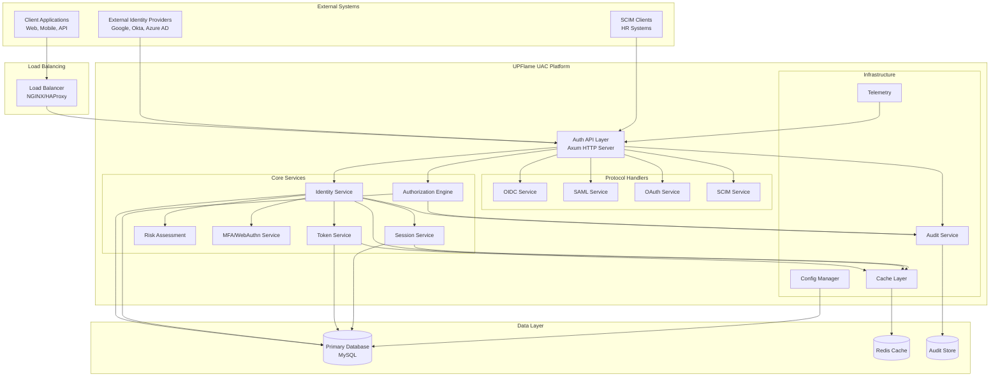
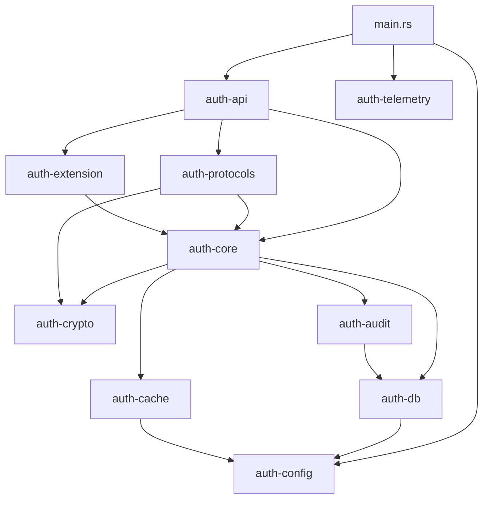
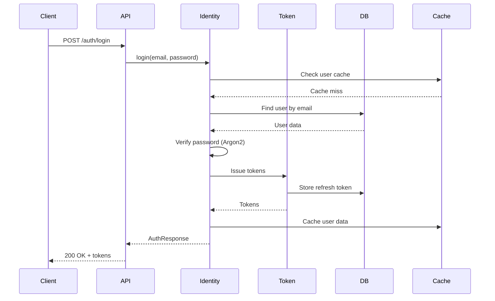
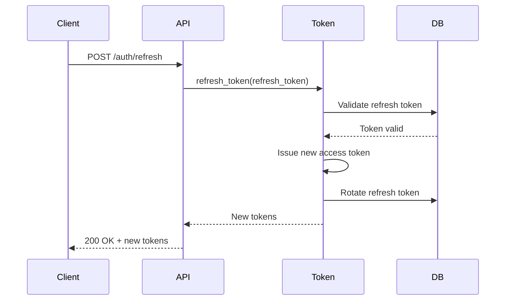

# Master Architecture Document

> [!IMPORTANT]
> **Purpose**: This document defines system boundaries, core services, communication flow, and the overall architecture of UPFlame Unified Auth Controller.

---

## 1. System Context

### 1.1 High-Level Architecture



### 1.2 System Boundaries

| Boundary | Inside | Outside |
|----------|--------|---------|
| **Trust Boundary** | UPFlame UAC services | Client apps, external IdPs |
| **Data Boundary** | MySQL, Redis, Audit DB | External databases |
| **Network Boundary** | Internal service mesh | Public internet |
| **Tenant Boundary** | Per-tenant data isolation | Cross-tenant access |

---

## 2. Crate Architecture

### 2.1 Workspace Organization

UPFlame UAC is organized as a **Cargo workspace** with **10 specialized crates**:

```
auth-platform/
├── crates/
│   ├── auth-core/          # Pure business logic
│   ├── auth-api/           # HTTP API layer
│   ├── auth-protocols/     # Protocol implementations
│   ├── auth-db/            # Database layer
│   ├── auth-config/        # Configuration management
│   ├── auth-crypto/        # Cryptographic operations
│   ├── auth-cache/         # Caching layer
│   ├── auth-telemetry/     # Observability
│   ├── auth-audit/         # Audit logging
│   └── auth-extension/     # GraphQL, scripting
└── src/
    └── main.rs             # Application entry point
```

### 2.2 Dependency Graph



**Dependency Rules**:
1. **No circular dependencies** - Enforced by Cargo
2. **Core is pure** - No I/O, only business logic
3. **API depends on Core** - Never the reverse
4. **DB is an implementation detail** - Core defines traits, DB implements

---

## 3. Core Services

### 3.1 Identity Service (`auth-core`)

**Responsibility**: User lifecycle management and authentication.

**Key Components**:
- `IdentityService`: Main service orchestrator
- `UserStore` trait: Database abstraction
- `AuthRequest`/`AuthResponse`: Request/response models

**Operations**:
- User registration
- Login (password, MFA, WebAuthn)
- Account lifecycle (ban, activate, delete)
- Password management

**Dependencies**:
- `TokenService`: Issue access/refresh tokens
- `UserRepository`: Database operations
- `PasswordHasher`: Argon2id hashing

---

### 3.2 Token Service (`auth-core`)

**Responsibility**: JWT token lifecycle management.

**Key Components**:
- `TokenEngine`: Token issuance and validation
- `TokenProvider` trait: Token operations interface
- `RefreshTokenRepository`: Refresh token storage
- `RevokedTokenRepository`: Token revocation list

**Token Types**:
- **Access Token**: JWT, RS256, 15-minute TTL
- **Refresh Token**: Opaque, database-backed, 30-day TTL

**Operations**:
- Issue access token
- Issue refresh token
- Validate access token
- Refresh access token
- Revoke tokens

**Security**:
- RS256 asymmetric signing
- Short-lived access tokens
- Refresh token rotation
- Token revocation list

---

### 3.3 Authorization Engine (`auth-core`)

**Responsibility**: RBAC and ABAC policy enforcement.

**Key Components**:
- `AuthorizationEngine`: Policy evaluation
- `AuthorizationProvider` trait: Authorization interface
- `Role`, `Permission`: RBAC models
- `Policy`, `Context`, `Decision`: ABAC models

**Operations**:
- Create/assign roles
- Evaluate permissions
- Policy-based authorization
- Context-aware decisions

**Models**:
- **RBAC**: User → Role → Permission
- **ABAC**: Policy + Context → Decision

---

### 3.4 Session Service (`auth-core`)

**Responsibility**: Session lifecycle and security.

**Key Components**:
- `SessionService`: Session management
- `SessionStore`: Session persistence
- Session fingerprinting

**Features**:
- Session creation and validation
- Device fingerprinting (IP, User-Agent)
- Concurrent session limits
- Session revocation
- Sudo Mode (planned)

**Security**:
- Fingerprint validation on every request
- Automatic session expiration
- Anomaly detection (unusual locations)

---

### 3.5 Risk Assessment Service (`auth-core`)

**Responsibility**: Risk scoring and adaptive authentication.

**Key Components**:
- `RiskAssessmentService`: Risk evaluation
- `RiskScore`: Risk level (Low, Medium, High, Critical)
- `RiskFactors`: IP reputation, device, behavior

**Operations**:
- Calculate risk score
- Adaptive MFA (require MFA on high-risk events)
- Anomaly detection
- Fraud prevention

**Factors**:
- IP reputation
- Device fingerprint
- Login patterns
- Geo-location
- Time of day

---

### 3.6 MFA/WebAuthn Service (`auth-core`)

**Responsibility**: Multi-factor authentication.

**Key Components**:
- `WebAuthnService`: FIDO2/WebAuthn operations
- TOTP generation and validation
- Backup code management

**Supported Methods**:
- TOTP (Time-based One-Time Password)
- WebAuthn/Passkeys (FIDO2)
- Backup codes
- SMS OTP (planned)

---

### 3.7 Subscription Service (`auth-core`)

**Responsibility**: Tenant subscription and billing.

**Key Components**:
- `SubscriptionService`: Subscription management
- `SubscriptionPlan`: Plan definitions
- `SubscriptionStatus`: Active, Suspended, Cancelled

**Features**:
- Plan management (Free, Pro, Enterprise)
- Feature flags per plan
- Usage tracking
- Billing integration (planned)

---

## 4. Protocol Handlers (`auth-protocols`)

### 4.1 OIDC Service

**Responsibility**: OpenID Connect 1.0 implementation.

**Endpoints**:
- `/.well-known/openid-configuration`: Discovery
- `/auth/oidc/authorize`: Authorization endpoint
- `/auth/oidc/token`: Token endpoint
- `/auth/oidc/userinfo`: UserInfo endpoint

**Flows**:
- Authorization Code flow
- Implicit flow (deprecated)
- Hybrid flow

---

### 4.2 SAML Service

**Responsibility**: SAML 2.0 implementation.

**Endpoints**:
- `/auth/saml/metadata`: SP metadata
- `/auth/saml/acs`: Assertion Consumer Service
- `/auth/saml/slo`: Single Logout

**Modes**:
- Service Provider (SP)
- Identity Provider (IdP)

**Flows**:
- SP-initiated SSO
- IdP-initiated SSO

---

### 4.3 OAuth Service

**Responsibility**: OAuth 2.1 implementation.

**Endpoints**:
- `/oauth/authorize`: Authorization endpoint
- `/oauth/token`: Token endpoint
- `/oauth/revoke`: Token revocation

**Flows**:
- Authorization Code + PKCE
- Client Credentials
- Refresh Token

---

### 4.4 SCIM Service

**Responsibility**: SCIM 2.0 user provisioning.

**Endpoints**:
- `/scim/v2/Users`: User management
- `/scim/v2/Groups`: Group management
- `/scim/v2/Schemas`: Schema discovery

**Operations**:
- CREATE, READ, UPDATE, DELETE users
- Bulk operations
- Filtering and pagination

---

## 5. Data Layer (`auth-db`)

### 5.1 Database Architecture

**Primary Database**: MySQL 8.0+

**Schema Organization**:
- **Users**: User accounts, credentials
- **Tenants**: Tenant configuration
- **Organizations**: Hierarchical org structure
- **Roles & Permissions**: RBAC data
- **Tokens**: Refresh tokens, revoked tokens
- **Sessions**: Active sessions
- **Audit Logs**: Immutable audit trail

### 5.2 Repository Pattern

**Traits** (defined in `auth-core`):
- `UserStore`: User operations
- `TenantStore`: Tenant operations
- `TokenStore`: Token operations
- `SessionStore`: Session operations

**Implementations** (in `auth-db`):
- `UserRepository`: MySQL implementation
- `TenantRepository`: MySQL implementation
- `RefreshTokenRepository`: MySQL implementation
- `RevokedTokenRepository`: MySQL implementation

**Benefits**:
- Testability (mock implementations)
- Database abstraction
- Compile-time query verification (sqlx)

---

### 5.3 Multitenancy Model

**Isolation Strategy**: **Row-level isolation with tenant_id**

```sql
-- Every table has tenant_id
CREATE TABLE users (
    id BINARY(16) PRIMARY KEY,
    tenant_id BINARY(16) NOT NULL,
    email VARCHAR(255) NOT NULL,
    -- ...
    UNIQUE KEY unique_email_per_tenant (tenant_id, email)
);

-- Queries always filter by tenant_id
SELECT * FROM users WHERE tenant_id = ? AND email = ?;
```

**Advantages**:
- Simple to implement
- Cost-effective
- Easy to backup/restore

**Security**:
- All queries MUST include `tenant_id`
- Enforced at repository level
- Compile-time verification with sqlx

---

## 6. Caching Layer (`auth-cache`)

### 6.1 Multi-Layer Caching

**L1 Cache**: In-memory (per-instance)
- **Technology**: `DashMap` (concurrent HashMap)
- **Use Case**: Hot data (user sessions, config)
- **TTL**: 5-15 minutes
- **Invalidation**: Time-based + manual

**L2 Cache**: Distributed (Redis)
- **Technology**: Redis
- **Use Case**: Shared state across instances
- **TTL**: 15-60 minutes
- **Invalidation**: Time-based + pub/sub

**L3 Cache**: CDN (planned)
- **Technology**: CloudFlare, Fastly
- **Use Case**: Static assets, public keys
- **TTL**: Hours to days

### 6.2 Cache Patterns

**Cache-Aside** (Lazy Loading):
```rust
async fn get_user(&self, id: Uuid) -> Result<User> {
    // Check L1 cache
    if let Some(user) = self.l1_cache.get(&id) {
        return Ok(user);
    }
    
    // Check L2 cache
    if let Some(user) = self.l2_cache.get(&id).await? {
        self.l1_cache.insert(id, user.clone());
        return Ok(user);
    }
    
    // Load from database
    let user = self.db.find_by_id(id).await?;
    
    // Populate caches
    self.l2_cache.set(&id, &user).await?;
    self.l1_cache.insert(id, user.clone());
    
    Ok(user)
}
```

**Write-Through**:
```rust
async fn update_user(&self, user: User) -> Result<()> {
    // Update database
    self.db.update(&user).await?;
    
    // Invalidate caches
    self.l1_cache.remove(&user.id);
    self.l2_cache.delete(&user.id).await?;
    
    Ok(())
}
```

---

## 7. Observability (`auth-telemetry`)

### 7.1 Logging

**Technology**: `tracing` crate

**Log Levels**:
- `error`: System errors
- `warn`: Security events, recoverable errors
- `info`: Business events (login, registration)
- `debug`: Detailed diagnostics
- `trace`: Very verbose

**Structured Logging**:
```rust
#[instrument(skip(password), fields(user_id = %user.id, request_id = %ctx.request_id))]
async fn login(&self, email: &str, password: &str) -> Result<AuthResponse> {
    info!("Login attempt");
    // ...
}
```

### 7.2 Metrics

**Technology**: Prometheus

**Key Metrics**:
- `auth_login_duration_seconds`: Histogram
- `auth_login_total`: Counter (success/failure)
- `auth_active_sessions`: Gauge
- `auth_token_issued_total`: Counter
- `auth_cache_hit_ratio`: Gauge

### 7.3 Distributed Tracing

**Technology**: OpenTelemetry

**Trace Propagation**:
- Request ID in all logs
- Span creation for key operations
- Context propagation across services

---

## 8. Security Architecture

### 8.1 Defense in Depth

**Layer 1: Network**
- TLS 1.3 for all connections
- Rate limiting at load balancer
- DDoS protection

**Layer 2: API**
- Input validation
- CSRF protection
- CORS configuration
- Security headers (CSP, HSTS, X-Frame-Options)

**Layer 3: Business Logic**
- Authentication required
- Authorization checks
- Tenant isolation enforcement

**Layer 4: Data**
- Encryption at rest
- Encrypted database connections
- PII masking in logs

### 8.2 Cryptography

**Password Hashing**: Argon2id
- Memory-hard algorithm
- Resistant to GPU attacks
- Configurable cost parameters

**JWT Signing**: RS256
- Asymmetric algorithm
- Private key for signing
- Public key for verification
- Key rotation support

**WebAuthn**: FIDO2
- Public key cryptography
- Hardware-backed keys
- Phishing-resistant

---

## 9. Deployment Architecture

### 9.1 Modular Monolith (Current)

**Architecture**: Single binary, multiple crates

**Advantages**:
- Simple deployment
- Low operational overhead
- Easy local development
- Shared memory (no serialization)

**Disadvantages**:
- Single point of failure
- Vertical scaling limits
- All-or-nothing deployment

### 9.2 Microservices (Future)

**Architecture**: Independent services per crate

**Services**:
- Identity Service
- Token Service
- Authorization Service
- Protocol Gateway (OIDC, SAML, OAuth)
- Audit Service

**Communication**: gRPC or HTTP/JSON

**Advantages**:
- Independent scaling
- Fault isolation
- Technology flexibility
- Team autonomy

**Challenges**:
- Distributed tracing complexity
- Network latency
- Data consistency

---

## 10. Scalability Strategy

### 10.1 Horizontal Scaling

**Stateless API Servers**:
- No local state
- Session data in Redis
- Load balancer distributes traffic

**Database Sharding**:
- Shard by `tenant_id`
- Each shard handles subset of tenants
- Consistent hashing for shard assignment

**Read Replicas**:
- Master for writes
- Replicas for reads
- Eventual consistency acceptable for most reads

### 10.2 Performance Targets

| Metric | Target | Strategy |
|--------|--------|----------|
| Auth Latency | <50ms p95 | Caching, connection pooling |
| Throughput | 10k auth/sec | Horizontal scaling |
| Concurrent Users | 100k-1M | Stateless design, sharding |
| Database Queries | <20ms p95 | Indexing, query optimization |

---

## 11. Data Flow Diagrams

### 11.1 Login Flow



### 11.2 Token Refresh Flow



---

## 12. Technology Stack

### 12.1 Core Technologies

| Component | Technology | Rationale |
|-----------|-----------|-----------|
| **Language** | Rust | Memory safety, performance, concurrency |
| **HTTP Server** | Axum | Async, type-safe, fast |
| **Database** | MySQL 8.0+ | ACID, mature, scalable |
| **Cache** | Redis | Fast, distributed, pub/sub |
| **Crypto** | Argon2id, RS256 | Industry standard, secure |
| **Observability** | Prometheus, OpenTelemetry | Standard, ecosystem support |

### 12.2 Key Dependencies

- `tokio`: Async runtime
- `sqlx`: Compile-time verified SQL
- `axum`: HTTP framework
- `jsonwebtoken`: JWT operations
- `argon2`: Password hashing
- `webauthn-rs`: FIDO2/WebAuthn
- `tracing`: Structured logging
- `prometheus`: Metrics

---

## 13. Architecture Decision Records (ADRs)

Key architectural decisions documented:

- **ADR-001**: Use Rust for implementation
- **ADR-002**: Modular monolith architecture
- **ADR-003**: Argon2id for password hashing
- **ADR-004**: RS256 for JWT signing
- **ADR-005**: Row-level multitenancy with tenant_id
- **ADR-006**: Repository pattern for data access

See `docs/08_governance/` for full ADRs.

---

**Document Status**: Active  
**Next Review**: 2026-04-12 (3 months)  
**Owner**: Architecture Team
