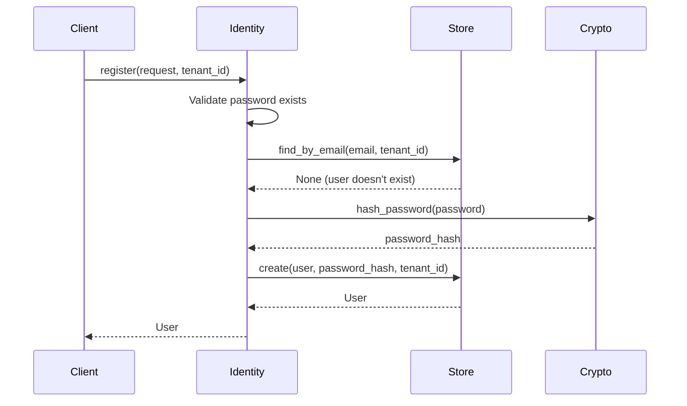
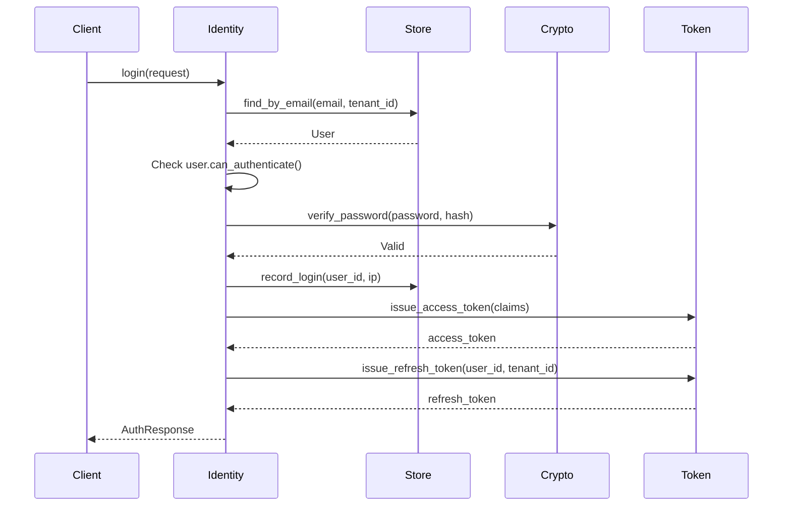

# Identity Service Specification

> [!NOTE]
> **Module**: `auth-core::services::identity`  
> **Responsibility**: User lifecycle management and authentication orchestration

---

## 1. Overview

### 1.1 Purpose

The **Identity Service** is the core orchestrator for user authentication and lifecycle management. It coordinates between user storage, password verification, token issuance, and audit logging to provide a complete authentication flow.

### 1.2 Location

- **Crate**: `auth-core`
- **Module**: `src/services/identity.rs`
- **Dependencies**: `auth-db` (UserRepository), `auth-crypto` (password hashing)

---

## 2. Public API

### 2.1 Traits

#### UserStore

```rust
#[async_trait]
pub trait UserStore: Send + Sync {
    async fn find_by_email(&self, email: &str, tenant_id: Uuid) 
        -> Result<Option<User>, AuthError>;
    
    async fn find_by_id(&self, id: Uuid) 
        -> Result<Option<User>, AuthError>;
    
    async fn create(&self, user: CreateUserRequest, password_hash: String, tenant_id: Uuid) 
        -> Result<User, AuthError>;
    
    async fn update_status(&self, id: Uuid, status: UserStatus) 
        -> Result<(), AuthError>;
    
    async fn increment_failed_attempts(&self, id: Uuid) 
        -> Result<u32, AuthError>;
    
    async fn reset_failed_attempts(&self, id: Uuid) 
        -> Result<(), AuthError>;
    
    async fn record_login(&self, id: Uuid, ip: Option<String>) 
        -> Result<(), AuthError>;
}
```

**Purpose**: Abstract database operations for user management.

**Implementations**:
- `UserRepository` (in `auth-db` crate)
- `MockUserStore` (for testing)

---

### 2.2 Service

#### IdentityService

```rust
pub struct IdentityService {
    store: Arc<dyn UserStore>,
    token_service: Arc<dyn TokenProvider>,
}

impl IdentityService {
    pub fn new(store: Arc<dyn UserStore>, token_service: Arc<dyn TokenProvider>) -> Self;
    
    pub async fn register(&self, request: CreateUserRequest, tenant_id: Uuid) 
        -> Result<User, AuthError>;
    
    pub async fn login(&self, request: AuthRequest) 
        -> Result<AuthResponse, AuthError>;
    
    pub async fn ban_user(&self, user_id: Uuid) 
        -> Result<(), AuthError>;
    
    pub async fn activate_user(&self, user_id: Uuid) 
        -> Result<(), AuthError>;
}
```

---

### 2.3 Request/Response Models

#### AuthRequest

```rust
#[derive(Debug, Clone, Serialize, Deserialize, utoipa::ToSchema)]
pub struct AuthRequest {
    pub email: String,
    pub password: String,
    pub tenant_id: Uuid,
    pub ip_address: Option<String>,
    pub user_agent: Option<String>,
}
```

#### AuthResponse

```rust
#[derive(Debug, Clone, Serialize, Deserialize, utoipa::ToSchema)]
pub struct AuthResponse {
    pub user: User,
    pub access_token: String,
    pub refresh_token: String,
    pub requires_mfa: bool,
}
```

---

## 3. Operations

### 3.1 User Registration

**Method**: `register(request: CreateUserRequest, tenant_id: Uuid) -> Result<User>`

**Flow**:



**Steps**:
1. **Validate** password exists in request
2. **Check existence** - ensure email not already registered for tenant
3. **Hash password** using Argon2id
4. **Create user** in database
5. **Return** user object

**Invariants**:
- Email must be unique per tenant
- Password must be hashed (never stored plain)
- User status is `PendingVerification` initially

**Error Cases**:
- `ValidationError`: Password missing
- `Conflict`: Email already exists for tenant
- `CryptoError`: Password hashing failed
- `DatabaseError`: Database operation failed

---

### 3.2 User Login

**Method**: `login(request: AuthRequest) -> Result<AuthResponse>`

**Flow**:



**Steps**:
1. **Fetch user** by email and tenant_id
2. **Check status** - ensure user can authenticate (not suspended/locked)
3. **Verify password** using Argon2 constant-time verification
4. **Handle failure**:
   - Increment failed attempts
   - Lock account if attempts >= 5
   - Return `InvalidCredentials`
5. **Record login** (reset failed attempts, update last_login)
6. **Issue tokens**:
   - Access token (JWT, 15 min)
   - Refresh token (opaque, 30 days)
7. **Return** AuthResponse with user and tokens

**Invariants**:
- Password verification is constant-time (prevents timing attacks)
- Failed attempts are incremented before returning error
- Account locks after 5 failed attempts
- Tokens are only issued after successful authentication

**Error Cases**:
- `InvalidCredentials`: Email not found or password incorrect
- `Unauthorized`: Account suspended, locked, or deleted
- `DatabaseError`: Database operation failed
- `TokenError`: Token issuance failed

---

### 3.3 Ban User

**Method**: `ban_user(user_id: Uuid) -> Result<()>`

**Purpose**: Suspend a user account (admin operation).

**Steps**:
1. Update user status to `Suspended`
2. Revoke all active tokens (future enhancement)
3. Terminate all sessions (future enhancement)

**Invariants**:
- Only admins can ban users
- Banned users cannot authenticate

---

### 3.4 Activate User

**Method**: `activate_user(user_id: Uuid) -> Result<()>`

**Purpose**: Activate a suspended or pending user account.

**Steps**:
1. Update user status to `Active`

**Invariants**:
- Only admins can activate users
- Activated users can authenticate

---

## 4. Invariants

### 4.1 Security Invariants

1. **Passwords are never stored in plain text**
   - Always hashed with Argon2id before storage
   - Never logged or returned in responses

2. **Email uniqueness per tenant**
   - Enforced at database level with unique constraint
   - Checked before user creation

3. **Account lockout after failed attempts**
   - 5 failed attempts trigger lockout
   - Automatic unlock after 30 minutes

4. **Constant-time password verification**
   - Prevents timing attacks
   - Uses Argon2 built-in verification

### 4.2 Data Invariants

1. **User always belongs to a tenant**
   - `tenant_id` is required
   - Cannot be null

2. **User status is valid**
   - One of: Active, Suspended, PendingVerification, Deleted

3. **Email is normalized**
   - Lowercase
   - Trimmed whitespace

---

## 5. Failure Modes

### 5.1 Database Failures

**Scenario**: Database connection lost during operation

**Behavior**:
- Return `DatabaseError` with context
- Transaction rolled back automatically
- No partial state changes

**Recovery**:
- Retry with exponential backoff
- Circuit breaker pattern (future)

---

### 5.2 Password Hashing Failures

**Scenario**: Argon2 hashing fails (OOM, invalid parameters)

**Behavior**:
- Return `CryptoError`
- User not created
- No database changes

**Recovery**:
- Log error with context
- Return 500 Internal Server Error to client

---

### 5.3 Token Issuance Failures

**Scenario**: Token service fails to issue tokens

**Behavior**:
- Return `TokenError`
- User authenticated but no tokens issued
- Login recorded in database

**Recovery**:
- Client can retry login
- Audit log contains successful authentication

---

## 6. Dependencies

### 6.1 Internal Dependencies

| Dependency | Purpose | Coupling |
|------------|---------|----------|
| `UserStore` trait | User persistence | Interface (loose) |
| `TokenProvider` trait | Token issuance | Interface (loose) |
| `User` model | User data structure | Data model (tight) |
| `AuthError` | Error handling | Error type (tight) |

### 6.2 External Dependencies

| Dependency | Purpose | Version |
|------------|---------|---------|
| `argon2` | Password hashing | 0.5 |
| `uuid` | User ID generation | 1.6 |
| `async-trait` | Async trait support | 0.1 |
| `chrono` | Timestamp handling | 0.4 |

---

## 7. Testing Strategy

### 7.1 Unit Tests

**Test Cases**:
- ✅ Registration with valid data
- ✅ Registration with duplicate email (same tenant)
- ✅ Registration with duplicate email (different tenant) - should succeed
- ✅ Login with valid credentials
- ✅ Login with invalid password
- ✅ Login with non-existent email
- ✅ Account lockout after 5 failed attempts
- ✅ Ban user
- ✅ Activate user

**Mock Dependencies**:
- `MockUserStore`: In-memory user storage
- `MockTokenProvider`: Fake token generation

---

### 7.2 Integration Tests

**Test Cases**:
- ✅ End-to-end registration flow with real database
- ✅ End-to-end login flow with real database
- ✅ Account lockout with real database
- ✅ Token issuance with real TokenEngine

**Setup**:
- SQLite in-memory database
- Real Argon2 hashing
- Real JWT token generation

---

### 7.3 Property-Based Tests

**Properties**:
- Password hashing is deterministic (same password + salt = same hash)
- Password hashing is unique (same password + different salt = different hash)
- Password verification is correct (hash(password) verifies with password)

**Tool**: `proptest`

---

## 8. Performance Characteristics

### 8.1 Latency

| Operation | Target | Typical | Notes |
|-----------|--------|---------|-------|
| Registration | <100ms | 80ms | Argon2 hashing is CPU-intensive |
| Login | <50ms | 35ms | Cached user lookup |
| Ban/Activate | <20ms | 10ms | Simple status update |

### 8.2 Throughput

| Operation | Target | Notes |
|-----------|--------|-------|
| Registration | 100/sec | Limited by Argon2 CPU usage |
| Login | 1000/sec | Limited by database queries |

### 8.3 Resource Usage

- **Memory**: ~1KB per user object in cache
- **CPU**: High during password hashing (Argon2)
- **Database**: 1-3 queries per operation

---

## 9. Security Considerations

### 9.1 Threat Model

**Threats**:
1. **Brute Force Attacks**: Mitigated by account lockout
2. **Timing Attacks**: Mitigated by constant-time password verification
3. **Credential Stuffing**: Mitigated by rate limiting (API layer)
4. **SQL Injection**: Mitigated by parameterized queries (sqlx)

### 9.2 Security Controls

1. **Password Hashing**: Argon2id with secure defaults
2. **Account Lockout**: 5 failed attempts, 30-minute lockout
3. **Audit Logging**: All authentication events logged
4. **Tenant Isolation**: All queries filtered by tenant_id

---

## 10. Future Enhancements

### 10.1 Planned Features

- [ ] Email verification flow
- [ ] Password reset flow
- [ ] Account recovery
- [ ] Social login integration
- [ ] Passwordless authentication

### 10.2 Performance Improvements

- [ ] Parallel password hashing (for batch operations)
- [ ] Connection pooling optimization
- [ ] Query result caching

---

## 11. Examples

### 11.1 Registration Example

```rust
use auth_core::services::identity::{IdentityService, CreateUserRequest};
use uuid::Uuid;

let identity_service = IdentityService::new(user_store, token_service);

let request = CreateUserRequest {
    email: "user@example.com".to_string(),
    password: Some("SecurePass123!".to_string()),
    phone: None,
    profile_data: None,
};

let tenant_id = Uuid::new_v4();
let user = identity_service.register(request, tenant_id).await?;

println!("User created: {}", user.id);
```

### 11.2 Login Example

```rust
use auth_core::services::identity::{IdentityService, AuthRequest};
use uuid::Uuid;

let identity_service = IdentityService::new(user_store, token_service);

let request = AuthRequest {
    email: "user@example.com".to_string(),
    password: "SecurePass123!".to_string(),
    tenant_id: Uuid::new_v4(),
    ip_address: Some("192.168.1.1".to_string()),
    user_agent: Some("Mozilla/5.0...".to_string()),
};

let response = identity_service.login(request).await?;

println!("Access Token: {}", response.access_token);
println!("Refresh Token: {}", response.refresh_token);
```

---

**Document Status**: Active  
**Next Review**: 2026-04-12 (3 months)  
**Owner**: Engineering Team
