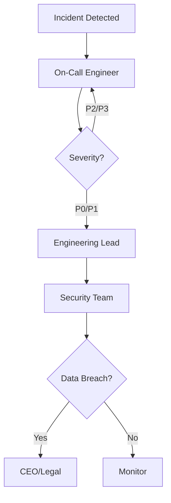

# Incident Response Playbooks

> [!CAUTION]
> **Purpose**: Procedures for responding to security incidents. Follow these playbooks during incidents.

---

## 1. Incident Classification

### 1.1 Severity Levels

| Level | Description | Response Time | Examples |
|-------|-------------|---------------|----------|
| **P0 - Critical** | Active breach, data loss | Immediate | Database breach, mass token theft |
| **P1 - High** | Potential breach, service disruption | <1 hour | Suspicious access patterns, DDoS |
| **P2 - Medium** | Security concern, no immediate threat | <4 hours | Failed security scan, config issue |
| **P3 - Low** | Minor security issue | <24 hours | Outdated dependency |

---

## 2. Playbook: Token Compromise

### 2.1 Detection

**Indicators**:
- Multiple failed token validations
- Token used from unusual location
- Token used after user logout
- Alert from security monitoring

---

### 2.2 Response Steps

#### Step 1: Containment (Immediate)

```bash
# Revoke all tokens for affected user
POST /admin/users/{user_id}/revoke-all-tokens

# Force logout all sessions
POST /admin/users/{user_id}/logout-all
```

#### Step 2: Investigation (Within 1 hour)

1. **Query audit logs**:
   ```sql
   SELECT * FROM audit_logs 
   WHERE user_id = ? 
   AND timestamp > DATE_SUB(NOW(), INTERVAL 24 HOUR)
   ORDER BY timestamp DESC;
   ```

2. **Identify compromise vector**:
   - Check for unusual IP addresses
   - Review session fingerprints
   - Analyze access patterns

3. **Determine scope**:
   - Single user or multiple users?
   - Single tenant or multiple tenants?
   - What data was accessed?

#### Step 3: Eradication (Within 4 hours)

1. **Reset user credentials**:
   - Force password reset
   - Regenerate MFA secrets
   - Revoke all API keys

2. **Rotate signing keys** (if compromised):
   ```bash
   # Generate new JWT signing key
   openssl genrsa -out new_private_key.pem 2048
   openssl rsa -in new_private_key.pem -pubout -out new_public_key.pem
   
   # Deploy new keys (zero-downtime)
   # Old keys remain valid for 24 hours
   ```

#### Step 4: Recovery (Within 24 hours)

1. **Notify affected users**
2. **Monitor for continued suspicious activity**
3. **Document incident**

#### Step 5: Post-Incident Review (Within 1 week)

1. **Root cause analysis**
2. **Update security controls**
3. **Update playbook**

---

## 3. Playbook: Tenant Breach

### 3.1 Detection

**Indicators**:
- Cross-tenant data access detected
- Tenant reports unauthorized access
- Audit log anomalies

---

### 3.2 Response Steps

#### Step 1: Containment (Immediate)

```bash
# Suspend affected tenant
POST /admin/tenants/{tenant_id}/suspend

# Revoke all tokens for tenant
POST /admin/tenants/{tenant_id}/revoke-all-tokens
```

#### Step 2: Investigation (Within 1 hour)

1. **Forensic analysis**:
   - Review all tenant access logs
   - Identify compromised accounts
   - Determine data exposure

2. **Preserve evidence**:
   - Export audit logs
   - Snapshot database
   - Capture network logs

#### Step 3: Notification (Within 4 hours)

1. **Notify tenant admin**
2. **Provide incident details**
3. **Offer remediation support**

#### Step 4: Remediation (Within 24 hours)

1. **Fix vulnerability**
2. **Restore tenant access** (if safe)
3. **Implement additional monitoring**

#### Step 5: Compliance (Within 72 hours)

1. **Notify regulators** (if required by GDPR, HIPAA, etc.)
2. **Document breach notification**
3. **Update compliance reports**

---

## 4. Playbook: DDoS Attack

### 3.1 Detection

**Indicators**:
- Spike in traffic
- Increased latency
- Service unavailability
- Rate limit triggers

---

### 4.2 Response Steps

#### Step 1: Containment (Immediate)

1. **Enable aggressive rate limiting**:
   ```toml
   [rate_limiting]
   requests_per_minute = 1  # Reduce from 5
   ```

2. **Block malicious IPs**:
   ```bash
   # Add to firewall blocklist
   iptables -A INPUT -s <malicious_ip> -j DROP
   ```

3. **Enable CDN DDoS protection** (if available)

#### Step 2: Mitigation (Within 30 minutes)

1. **Scale horizontally**:
   - Add more API instances
   - Increase database connections

2. **Enable caching**:
   - Increase cache TTL
   - Cache more endpoints

#### Step 3: Recovery (Within 4 hours)

1. **Monitor traffic patterns**
2. **Gradually restore normal rate limits**
3. **Document attack patterns**

---

## 5. Playbook: Insider Threat

### 5.1 Detection

**Indicators**:
- Unusual admin activity
- Mass data export
- Unauthorized configuration changes
- Privilege escalation attempts

---

### 5.2 Response Steps

#### Step 1: Containment (Immediate)

```bash
# Suspend user account
POST /admin/users/{user_id}/suspend

# Revoke all access
POST /admin/users/{user_id}/revoke-all-access
```

#### Step 2: Investigation (Within 1 hour)

1. **Review audit logs**:
   - All actions by user
   - Data accessed
   - Configuration changes

2. **Identify accomplices**:
   - Check for coordinated activity
   - Review shared accounts

#### Step 3: Legal (Within 4 hours)

1. **Notify legal team**
2. **Preserve evidence**
3. **Consider law enforcement**

---

## 6. Escalation Procedures

### 6.1 Escalation Path



### 6.2 Contact List

| Role | Contact | Escalation Time |
|------|---------|-----------------|
| On-Call Engineer | PagerDuty | Immediate |
| Engineering Lead | Email/Phone | P0/P1: Immediate |
| Security Team | Email/Phone | P0/P1: <15 min |
| CEO | Phone | Data breach: <1 hour |
| Legal | Email/Phone | Data breach: <1 hour |

---

## 7. Post-Incident Review Template

### 7.1 Incident Summary

- **Incident ID**: INC-2026-001
- **Date**: 2026-01-12
- **Severity**: P1
- **Duration**: 2 hours
- **Impact**: 100 users affected

### 7.2 Timeline

| Time | Event |
|------|-------|
| 10:00 | Incident detected |
| 10:05 | On-call engineer notified |
| 10:15 | Containment actions taken |
| 12:00 | Incident resolved |

### 7.3 Root Cause

- **Cause**: SQL injection vulnerability
- **How Detected**: Security scan
- **Why It Happened**: Missing input validation

### 7.4 Action Items

- [ ] Fix vulnerability
- [ ] Add input validation
- [ ] Update security tests
- [ ] Update playbook

---

**Document Status**: Active  
**Next Review**: 2026-04-12 (3 months)  
**Owner**: Security Team
