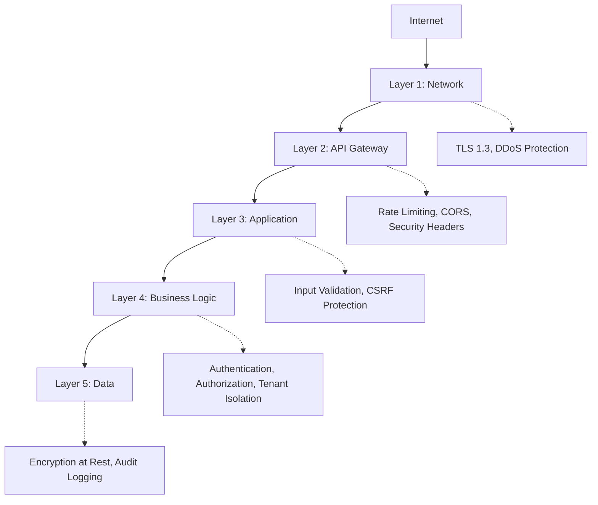

# Security Architecture & Controls

> [!IMPORTANT]
> **Purpose**: Document how security is enforced at every layer of the system.

---

## 1. Defense in Depth

UPFlame UAC implements **defense in depth** with security controls at multiple layers:



---

## 2. Layer-by-Layer Controls

### 2.1 Network Layer

**Controls**:
- ✅ TLS 1.3 for all connections
- ✅ HTTPS only (no HTTP)
- 📋 DDoS protection (CDN, planned)
- 📋 WAF (Web Application Firewall, planned)

**Configuration**:
```toml
[server]
tls_enabled = true
tls_min_version = "1.3"
http_redirect_to_https = true
```

---

### 2.2 API Gateway Layer

**Controls**:
- ✅ Rate limiting (5 req/min for auth endpoints)
- ✅ CORS configuration
- ✅ Security headers (CSP, HSTS, X-Frame-Options)
- ✅ Request size limits

**Security Headers**:
```http
Strict-Transport-Security: max-age=31536000; includeSubDomains
X-Frame-Options: DENY
X-Content-Type-Options: nosniff
Content-Security-Policy: default-src 'self'
X-XSS-Protection: 1; mode=block
```

---

### 2.3 Application Layer

**Controls**:
- ✅ Input validation (validator crate)
- ✅ CSRF protection
- ✅ SQL injection prevention (parameterized queries)
- ✅ XSS prevention (output encoding)

---

### 2.4 Business Logic Layer

**Controls**:
- ✅ Authentication required
- ✅ Authorization checks (RBAC)
- ✅ Tenant isolation enforcement
- ✅ Session validation

---

### 2.5 Data Layer

**Controls**:
- ✅ Encryption at rest (database-level)
- ✅ Encrypted connections (TLS)
- ✅ PII masking in logs
- ✅ Immutable audit logs

---

## 3. Authentication Security

### 3.1 Password Security

**Controls**:
- ✅ Argon2id hashing (memory-hard)
- ✅ Minimum 12 characters
- ✅ Complexity requirements
- ✅ Common password blacklist
- ✅ Never logged or returned

**Argon2 Parameters**:
```rust
Argon2::default() // Uses secure defaults:
// - Memory: 19 MiB
// - Iterations: 2
// - Parallelism: 1
```

---

### 3.2 Token Security

**Access Tokens (JWT)**:
- ✅ RS256 signing (asymmetric)
- ✅ Short-lived (15 minutes)
- ✅ Signature verification on every request
- ✅ Revocation list (jti)

**Refresh Tokens**:
- ✅ Opaque (not JWT)
- ✅ Hashed storage (SHA-256)
- ✅ Single-use (rotation)
- ✅ Long-lived (30 days)

---

### 3.3 Session Security

**Controls**:
- ✅ Session fingerprinting (IP, User-Agent)
- ✅ Automatic expiration (24 hours)
- ✅ Concurrent session limits (5 per user)
- ✅ Revocation on logout

---

## 4. Tenant Isolation

### 4.1 Database-Level Isolation

**Strategy**: Row-level isolation with `tenant_id`

**Enforcement**:
```rust
// ✅ CORRECT: All queries include tenant_id
sqlx::query_as::<_, User>(
    "SELECT * FROM users WHERE tenant_id = ? AND email = ?"
)
.bind(tenant_id)
.bind(email)
.fetch_optional(&pool)
.await?

// ❌ WRONG: Missing tenant_id (compile error with sqlx)
sqlx::query_as::<_, User>(
    "SELECT * FROM users WHERE email = ?"
)
.bind(email)
.fetch_optional(&pool)
.await?
```

**Database Constraints**:
```sql
-- Unique email per tenant
UNIQUE KEY unique_email_per_tenant (tenant_id, email)

-- All foreign keys include tenant_id
FOREIGN KEY (user_id, tenant_id) REFERENCES users(id, tenant_id)
```

---

### 4.2 Cryptographic Isolation

**Per-Tenant Keys**:
- ✅ Per-tenant JWT signing keys (planned)
- ✅ Per-tenant encryption keys (planned)

**Benefits**:
- Key compromise limited to single tenant
- Tenant-specific key rotation

---

## 5. Secrets Management

### 5.1 Storage

**Rules**:
- ❌ Never commit secrets to Git
- ✅ Environment variables only
- ✅ Wrapped in `secrecy::Secret<T>`
- ✅ `.env.example` with placeholders

**Example**:
```rust
use secrecy::{Secret, ExposeSecret};

pub struct Config {
    pub jwt_secret: Secret<String>,
    pub database_url: Secret<String>,
}
```

---

### 5.2 Key Rotation

**JWT Signing Keys**:
- 📋 Automated rotation (planned)
- 📋 Multiple active keys (planned)
- 📋 Gradual rollover (planned)

**Database Encryption Keys**:
- 📋 KMS integration (planned)
- 📋 Automated rotation (planned)

---

## 6. Cryptography

### 6.1 Algorithms

| Purpose | Algorithm | Key Size | Rationale |
|---------|-----------|----------|-----------|
| Password Hashing | Argon2id | N/A | Memory-hard, GPU-resistant |
| JWT Signing | RS256 | 2048 bits | Asymmetric, industry standard |
| Refresh Token Hashing | SHA-256 | N/A | Fast, secure |
| TLS | TLS 1.3 | N/A | Latest standard |
| WebAuthn | FIDO2 | Varies | Hardware-backed |

---

### 6.2 Post-Quantum Readiness

**Status**: 📋 Planned for 2026 Q4

**Approach**:
- Hybrid cryptography (classical + post-quantum)
- NIST-approved algorithms
- Gradual migration path

---

## 7. Compliance Controls

### 7.1 SOC 2

**Controls**:
- ✅ Access controls (RBAC)
- ✅ Audit logging
- ✅ Encryption (TLS, at rest)
- ✅ Change management (ADRs)
- 🔄 Incident response plan (in progress)

---

### 7.2 HIPAA

**Controls**:
- ✅ Audit trails
- ✅ PII protection
- ✅ Access controls
- ✅ Encryption
- 🔄 BAA template (in progress)

---

### 7.3 PCI-DSS

**Controls**:
- ✅ Strong cryptography (Argon2, RS256)
- ✅ Access controls
- ✅ Audit logging
- ✅ Network security (TLS)

---

## 8. Security Monitoring

### 8.1 Logging

**Security Events Logged**:
- All authentication attempts (success/failure)
- Authorization decisions
- Configuration changes
- Token issuance/revocation
- Session creation/termination

---

### 8.2 Metrics

**Security Metrics**:
- Failed login attempts (counter)
- Account lockouts (counter)
- Token revocations (counter)
- Session hijacking attempts (counter)

---

### 8.3 Alerting (Planned)

**Alert Triggers**:
- 📋 Spike in failed logins
- 📋 Multiple account lockouts
- 📋 Unusual access patterns
- 📋 Configuration changes

---

**Document Status**: Active  
**Next Review**: 2026-04-12 (3 months)  
**Owner**: Security Team
