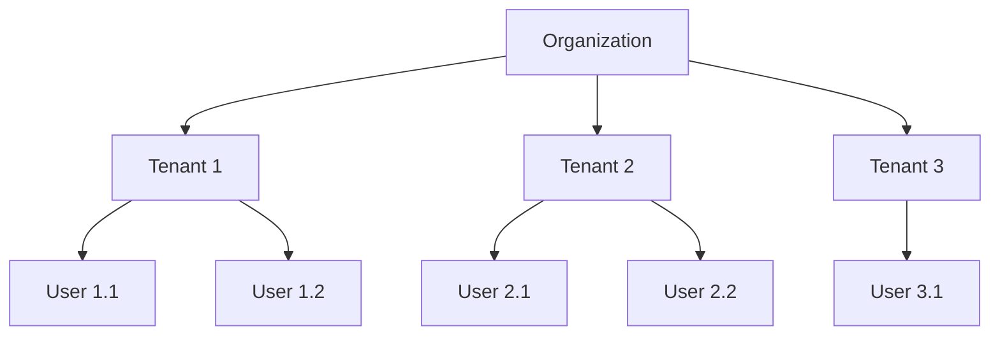

# Multitenant Model Specification

> [!IMPORTANT]
> **Purpose**: Deep dive into the tenant isolation model - the core differentiator of UPFlame UAC.

---

## 1. Hierarchical Model

### 1.1 Structure



**Hierarchy**: Organization → Tenant → User

**Relationships**:
- One organization has many tenants
- One tenant belongs to one organization
- One tenant has many users
- One user belongs to one tenant

---

## 2. Isolation Strategy

### 2.1 Row-Level Isolation

**Approach**: Every table includes `tenant_id` column.

**Database Schema**:
```sql
CREATE TABLE users (
    id BINARY(16) PRIMARY KEY,
    tenant_id BINARY(16) NOT NULL,
    email VARCHAR(255) NOT NULL,
    password_hash VARCHAR(255),
    created_at TIMESTAMP DEFAULT CURRENT_TIMESTAMP,
    
    -- Unique email per tenant
    UNIQUE KEY unique_email_per_tenant (tenant_id, email),
    
    -- Foreign key to tenants
    FOREIGN KEY (tenant_id) REFERENCES tenants(id) ON DELETE CASCADE,
    
    -- Index for tenant queries
    INDEX idx_tenant_id (tenant_id)
);
```

**Query Pattern**:
```rust
// ✅ CORRECT: Always filter by tenant_id
sqlx::query_as::<_, User>(
    "SELECT * FROM users WHERE tenant_id = ? AND email = ?"
)
.bind(tenant_id)
.bind(email)
.fetch_optional(&pool)
.await?
```

---

### 2.2 Advantages

| Advantage | Description |
|-----------|-------------|
| **Cost-Effective** | Single database for all tenants |
| **Simple Backup** | One backup covers all tenants |
| **Easy Scaling** | Add tenants without infrastructure changes |
| **Query Performance** | Indexes on tenant_id enable fast queries |

---

### 2.3 Security Guarantees

1. **Compile-Time Verification**: `sqlx` verifies queries at compile time
2. **Mandatory Filtering**: All queries MUST include `tenant_id`
3. **Foreign Key Constraints**: Prevent cross-tenant references
4. **Integration Tests**: Verify tenant isolation

---

## 3. Tenant Lifecycle

### 3.1 Tenant Creation

**Flow**:
1. Organization admin creates tenant
2. Generate tenant ID (UUID)
3. Create tenant record in database
4. Initialize tenant configuration (defaults)
5. Create first admin user for tenant

**API**:
```rust
POST /api/tenants
{
  "name": "Acme Corp",
  "organization_id": "org-uuid",
  "admin_email": "admin@acme.com"
}
```

---

### 3.2 Tenant Suspension

**Flow**:
1. Mark tenant as `Suspended`
2. Revoke all active tokens
3. Terminate all sessions
4. Block new logins

**Effect**: Immediate - all users locked out

---

### 3.3 Tenant Deletion

**Flow**:
1. Mark tenant as `Deleted`
2. Revoke all tokens
3. Soft delete (retain for 30 days)
4. Hard delete after retention period

**Data Retention**: 30 days for recovery

---

## 4. Per-Tenant Configuration

### 4.1 Configurable Settings

| Setting | Scope | Example |
|---------|-------|---------|
| **JWT Signing Key** | Per-tenant | Tenant-specific RS256 key |
| **Password Policy** | Per-tenant | Min length, complexity |
| **MFA Enforcement** | Per-tenant | Required for admins |
| **Session TTL** | Per-tenant | 24 hours vs. 1 hour |
| **Branding** | Per-tenant | Logo, colors |
| **Email Templates** | Per-tenant | Custom welcome email |

---

### 4.2 Configuration Storage

**Database Table**:
```sql
CREATE TABLE tenant_config (
    tenant_id BINARY(16) PRIMARY KEY,
    jwt_signing_key TEXT,
    password_min_length INT DEFAULT 12,
    mfa_required BOOLEAN DEFAULT FALSE,
    session_ttl_hours INT DEFAULT 24,
    branding_json JSON,
    
    FOREIGN KEY (tenant_id) REFERENCES tenants(id)
);
```

---

## 5. Cross-Tenant Access Prevention

### 5.1 Prevention Mechanisms

1. **Query Filtering**: All queries include `tenant_id`
2. **Authorization Checks**: Verify user belongs to tenant
3. **Token Validation**: JWT contains `tenant_id` claim
4. **Integration Tests**: Test cross-tenant access attempts

---

### 5.2 Example Prevention

```rust
// User tries to access another tenant's data
let user_tenant_id = claims.tenant_id; // From JWT
let requested_tenant_id = params.tenant_id; // From request

if user_tenant_id != requested_tenant_id {
    return Err(AuthError::Unauthorized {
        message: "Cross-tenant access denied".to_string()
    });
}
```

---

## 6. Future Enhancements

### 6.1 Schema-Per-Tenant (Planned)

**Approach**: Each tenant gets own database schema.

**Advantages**:
- Stronger isolation
- Easier tenant migration
- Per-tenant backups

**Challenges**:
- More complex management
- Higher cost

---

### 6.2 Database-Per-Tenant (Planned)

**Approach**: Each tenant gets own database.

**Advantages**:
- Maximum isolation
- Independent scaling
- Regulatory compliance (data residency)

**Challenges**:
- High operational overhead
- Cost prohibitive for small tenants

---

**Document Status**: Active  
**Owner**: Architecture Team
