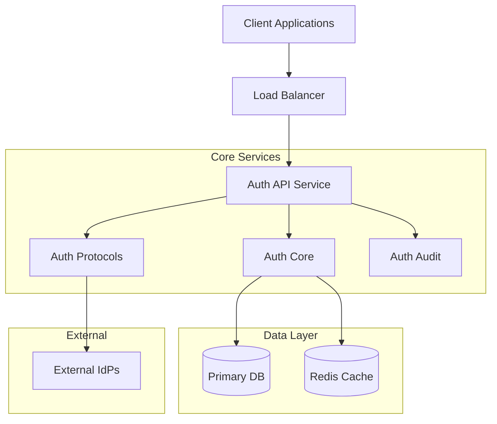

# Architectural Overview

## System Architecture

The Enterprise SSO Platform is built on a microservices-inspired architecture, designed for high scalability, security, and maintainability. While currently deployed as a modular monolith for operational simplicity, the strict separation of concerns allows for easy splitting into independent services.

## Component Description

### 1. Auth API (`crates/auth-api`)
The entry point for all external requests. Built with **Axum**, it handles:
- HTTP Protocol compliance
- Request validation
- Rate limiting
- Route dispatching
- OpenAPI (Swagger) documentation generation

### 2. Auth Core (`crates/auth-core`)
The brain of the operation. Contains pure business logic:
- User identity management
- Session handling
- Risk-based authentication rules
- Policy enforcement (RBAC/ABAC)

### 3. Auth Protocols (`crates/auth-protocols`)
Implements standard identity protocols:
- **OIDC/OAuth 2.1**: For modern web/mobile apps.
- **SAML 2.0**: For enterprise legacy integrations.
- **SCIM 2.0**: For automated user provisioning.

### 4. Auth Database (`crates/auth-db`)
Abstracts data access logic. Supports:
- **MySQL**: For production environments.
- **SQLite**: For lightweight development and testing.
- Uses `sqlx` for compile-time verified queries.

### 5. Auht Audit (`crates/auth-audit`)
Ensures compliance by logging every security-critical action.
- Immutable logs
- Structured JSON format
- PII masking

## Security Principles

- **Zero Trust**: No internal component trusts another implicitly.
- **Defense in Depth**: Multiple layers of validation (API, Core, DB).
- **Secure Defaults**: All security features (MFA, Audit) are on by default.
