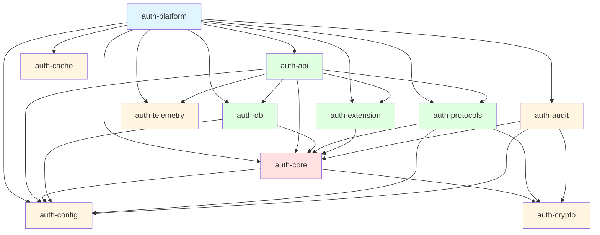

# Crate-Level Documentation

This document provides comprehensive documentation for all 11 crates in the Enterprise SSO Platform workspace.

## Overview

The platform is organized as a Cargo workspace with clear separation of concerns:

```
auth-platform (workspace root)
├── auth-platform (binary crate)
└── crates/
    ├── auth-core (library)
    ├── auth-api (library)
    ├── auth-protocols (library)
    ├── auth-db (library)
    ├── auth-config (library)
    ├── auth-crypto (library)
    ├── auth-cache (library)
    ├── auth-telemetry (library)
    ├── auth-audit (library)
    └── auth-extension (library)
```

---

## 1. auth-platform (Binary Crate)

**Type**: Binary  
**Path**: Root workspace  
**Entry Point**: [src/main.rs](file:///c:/Users/Victo/Downloads/sso/src/main.rs)

### Responsibility

Main application orchestrator that initializes and coordinates all services. Acts as the composition root for dependency injection and application bootstrapping.

### Key Functions

- **Configuration Loading**: Loads environment-specific configuration from TOML files and environment variables
- **Database Initialization**: Establishes MySQL connection pool and runs migrations
- **Service Composition**: Instantiates and wires together all application services
- **HTTP Server Startup**: Launches the Axum web server with configured routes and middleware
- **Graceful Shutdown**: Handles termination signals and cleanup

### Dependencies

**Internal**:
- `auth-config` - Configuration management
- `auth-core` - Business logic services
- `auth-api` - HTTP API layer
- `auth-db` - Database repositories
- `auth-audit` - Audit logging
- `auth-protocols` - Protocol handlers
- `auth-extension` - Extension framework
- `auth-cache` - Caching layer
- `auth-telemetry` - Observability

**External**:
- `tokio` - Async runtime
- `anyhow` - Error handling
- `tracing` - Structured logging
- `sqlx` - Database driver
- `dotenvy` - Environment variable loading

### Startup Sequence

1. Load `.env` file (development)
2. Initialize tracing subscriber
3. Load configuration from `config/` directory
4. Connect to MySQL database
5. Run database migrations
6. Initialize repositories (User, Role, Session, Subscription)
7. Initialize services (Identity, Authorization, Risk, Token, Session)
8. Create AppState with all dependencies
9. Build Axum router with middleware
10. Start HTTP server on configured port

### Test Binaries

The crate includes 12 test binaries in `src/bin/`:
- `test_mysql.rs` - MySQL connection testing
- `test_rbac.rs` - RBAC system testing
- `test_risk_session.rs` - Risk assessment and session testing
- `test_subscription.rs` - Subscription tier testing
- `test_audit.rs` - Audit logging testing
- `test_oauth.rs` - OAuth flow testing
- `test_audit_export.rs` - Audit export functionality
- `test_protocol_property.rs` - Protocol property-based testing
- `test_extension.rs` - Extension system testing
- `test_crypto_property.rs` - Cryptography property testing
- `test_passwordless.rs` - Passwordless authentication testing
- `test_auth_flow.rs` - End-to-end authentication flow testing

---

## 2. auth-core (Library Crate)

**Type**: Library  
**Path**: `crates/auth-core`  
**Entry Point**: [crates/auth-core/src/lib.rs](file:///c:/Users/Victo/Downloads/sso/crates/auth-core/src/lib.rs)

### Responsibility

Pure business logic layer containing domain models and application services. Independent of HTTP, database, or external protocol concerns.

### Architecture

**Domain Layer** (`models/`):
- User, Token, Session, Role, Permission, Tenant, Organization
- Business validation rules
- Domain-specific types and enums

**Application Layer** (`services/`):
- Identity management
- Authorization (RBAC/ABAC)
- Token lifecycle
- Session management
- Risk assessment
- Subscription management

### Key Components

#### Models (`models/`)
- **user.rs**: User entity with email, password, MFA, risk score
- **token.rs**: JWT token structure and claims
- **session.rs**: Session entity with fingerprinting
- **role.rs**: RBAC role definitions
- **permission.rs**: Permission model for fine-grained access control
- **tenant.rs**: Multi-tenant isolation model
- **organization.rs**: Hierarchical organization structure
- **password_policy.rs**: Password complexity rules
- **subscription.rs**: Subscription tier and limits
- **user_tenant.rs**: User-tenant relationship mapping

#### Services (`services/`)
- **identity.rs**: User registration, login, lifecycle management
- **authorization.rs**: Permission checking, RBAC/ABAC enforcement
- **credential.rs**: Password hashing and verification
- **token_service.rs**: JWT generation, validation, refresh, revocation
- **session_service.rs**: Session creation, validation, fingerprinting
- **role_service.rs**: Role assignment, permission management
- **risk_assessment.rs**: Fraud detection, adaptive MFA triggering
- **subscription_service.rs**: Subscription tier management

### Dependencies

**Internal**: 
- `auth-config` - Configuration types
- `auth-crypto` - Cryptographic operations

**External**:
- `tokio` - Async runtime
- `serde` - Serialization
- `uuid` - Unique identifiers
- `chrono` - Date/time handling
- `argon2` - Password hashing
- `jsonwebtoken` - JWT operations
- `validator` - Input validation
- `dashmap` - Concurrent hash maps
- `webauthn-rs` - Passwordless authentication

### Public API

```rust
pub mod error;
pub mod models;
pub mod services;

pub use error::AuthError;

pub mod prelude {
    pub use crate::error::AuthError;
    pub use crate::models::*;
    pub use crate::services::*;
}
```

### Security Considerations

- **No external dependencies**: Pure business logic, no I/O
- **Trait-based abstractions**: Testable, mockable interfaces
- **Comprehensive validation**: All inputs validated before processing
- **Secure defaults**: Conservative security settings

---

## 3. auth-api (Library Crate)

**Type**: Library  
**Path**: `crates/auth-api`  
**Entry Point**: [crates/auth-api/src/lib.rs](file:///c:/Users/Victo/Downloads/sso/crates/auth-api/src/lib.rs)

### Responsibility

HTTP API layer built with Axum framework. Handles request routing, validation, error handling, and response formatting.

### Key Components

#### Handlers (`handlers/`)
- **auth.rs**: Login, logout, register, token refresh endpoints
- **auth_oidc.rs**: OpenID Connect flow handlers
- **auth_saml.rs**: SAML SSO handlers
- **health.rs**: Health check endpoints
- **users.rs**: User management endpoints (ban, activate, update)

#### Middleware (`middleware/`)
- **rate_limit.rs**: Token bucket rate limiting (5 req/min per IP)
- **request_id.rs**: UUID-based request ID generation for tracing
- **security_headers.rs**: OWASP security headers (CSP, HSTS, X-Frame-Options)

#### Other Modules
- **router.rs**: Route configuration and composition
- **validation.rs**: Request validation logic
- **error.rs**: HTTP error responses with proper status codes

### Dependencies

**Internal**:
- `auth-core` - Business logic services
- `auth-db` - Database repositories
- `auth-config` - Configuration
- `auth-protocols` - Protocol handlers
- `auth-extension` - GraphQL API
- `auth-telemetry` - Metrics and tracing

**External**:
- `axum` - Web framework
- `tower` - Middleware abstractions
- `tower-http` - HTTP middleware
- `hyper` - HTTP implementation
- `utoipa` - OpenAPI documentation
- `utoipa-swagger-ui` - Swagger UI
- `validator` - Request validation
- `regex` - Pattern matching
- `dashmap` - Rate limit storage

### API Documentation

The crate provides OpenAPI 3.0 documentation via Swagger UI:
- **Endpoint**: `/swagger-ui`
- **OpenAPI Spec**: `/api-docs/openapi.json`

Documented endpoints:
- `POST /auth/login` - User authentication
- `POST /auth/register` - User registration
- `POST /users/{id}/ban` - Ban user account
- `POST /users/{id}/activate` - Activate user account
- `GET /health` - Health check

### AppState Structure

```rust
pub struct AppState {
    pub db: MySqlPool,
    pub role_service: Arc<RoleService>,
    pub session_service: Arc<SessionService>,
    pub subscription_service: Arc<SubscriptionService>,
    pub identity_service: Arc<IdentityService>,
}
```

---

## 4. auth-protocols (Library Crate)

**Type**: Library  
**Path**: `crates/auth-protocols`  
**Entry Point**: [crates/auth-protocols/src/lib.rs](file:///c:/Users/Victo/Downloads/sso/crates/auth-protocols/src/lib.rs)

### Responsibility

Implementation of authentication protocols: SAML 2.0, OpenID Connect 1.0, OAuth 2.1, and SCIM 2.0.

### Key Components

- **oauth.rs**: OAuth 2.1 authorization server implementation
- **oidc.rs**: OpenID Connect identity provider
- **saml.rs**: SAML 2.0 service provider and identity provider
- **scim.rs**: SCIM 2.0 user provisioning API

### Dependencies

**Internal**:
- `auth-core` - User models and services
- `auth-config` - Protocol configuration
- `auth-crypto` - Signature verification

**External**:
- `openidconnect` - OIDC protocol library
- `reqwest` - HTTP client for external IdP communication
- `url` - URL parsing and manipulation

### Protocol Support

#### OAuth 2.1
- Authorization Code flow with PKCE
- Client Credentials flow
- Refresh Token rotation
- Token introspection
- Token revocation

#### OpenID Connect 1.0
- Authorization Code flow
- Implicit flow (deprecated, for legacy support)
- Hybrid flow
- UserInfo endpoint
- Discovery endpoint (`.well-known/openid-configuration`)

#### SAML 2.0
- Service Provider (SP) initiated SSO
- Identity Provider (IdP) initiated SSO
- Single Logout (SLO)
- Metadata exchange

#### SCIM 2.0
- User provisioning (Create, Read, Update, Delete)
- Group management
- Bulk operations
- Filtering and pagination

---

## 5. auth-db (Library Crate)

**Type**: Library  
**Path**: `crates/auth-db`  
**Entry Point**: [crates/auth-db/src/lib.rs](file:///c:/Users/Victo/Downloads/sso/crates/auth-db/src/lib.rs)

### Responsibility

Database persistence layer implementing the Repository pattern. Provides abstraction over MySQL and SQLite databases.

### Key Components

#### Repositories (`repositories/`)
- **user_repository.rs**: User CRUD operations
- **token_repository.rs**: Refresh token and revoked token storage
- **session_repository.rs**: Session persistence
- **role_repository.rs**: Role and permission storage
- **tenant_repository.rs**: Tenant management
- **organization_repository.rs**: Organization hierarchy
- **subscription_repository.rs**: Subscription tier management

#### Other Modules
- **connection.rs**: Database connection pooling and initialization
- **migrations/**: SQL migration files (managed by SQLx)

### Dependencies

**Internal**:
- `auth-core` - Domain models and trait definitions
- `auth-config` - Database configuration

**External**:
- `sqlx` - Async SQL toolkit with compile-time query checking
- `sea-query` - SQL query builder
- `secrecy` - Secure secret handling

### Database Support

- **Production**: MySQL 8.0+
- **Development**: SQLite 3.35+
- **Connection Pooling**: Configurable pool size (default: 10 connections)
- **Migrations**: Automatic migration on startup

### Query Safety

All queries use SQLx's compile-time checking to prevent:
- SQL injection
- Type mismatches
- Invalid column references
- Schema drift

---

## 6. auth-config (Library Crate)

**Type**: Library  
**Path**: `crates/auth-config`  
**Entry Point**: [crates/auth-config/src/lib.rs](file:///c:/Users/Victo/Downloads/sso/crates/auth-config/src/lib.rs)

### Responsibility

Dynamic configuration management system supporting multiple sources with precedence rules.

### Key Components

- **config.rs**: Configuration structure definitions
- **loader.rs**: Multi-source configuration loading
- **manager.rs**: Runtime configuration management
- **validation.rs**: Configuration validation rules

### Configuration Sources (Precedence Order)

1. **Environment Variables** (highest priority)
2. **Local Configuration** (`config/local.toml`)
3. **Environment-Specific** (`config/development.toml`, `config/production.toml`)
4. **Default Configuration** (`config/default.toml`)

### Dependencies

**External**:
- `config` - Configuration management library
- `toml` - TOML parsing
- `dotenvy` - Environment variable loading
- `serde` - Serialization
- `validator` - Configuration validation
- `dashmap` - Concurrent configuration updates
- `parking_lot` - Efficient locking

### Configuration Structure

```rust
pub struct Config {
    pub server: ServerConfig,
    pub database: DatabaseConfig,
    pub security: SecurityConfig,
    pub cache: CacheConfig,
    pub telemetry: TelemetryConfig,
}
```

### Features

- **Hot Reload**: Runtime configuration updates without restart
- **Validation**: Comprehensive validation on load
- **Type Safety**: Strongly-typed configuration structs
- **Secret Management**: Integration with secrecy crate

---

## 7. auth-crypto (Library Crate)

**Type**: Library  
**Path**: `crates/auth-crypto`  
**Entry Point**: [crates/auth-crypto/src/lib.rs](file:///c:/Users/Victo/Downloads/sso/crates/auth-crypto/src/lib.rs)

### Responsibility

Cryptographic operations including password hashing, JWT signing, key management, and post-quantum cryptography support.

### Key Components

- **password.rs**: Argon2id password hashing and verification
- **jwt.rs**: JWT signing and verification with RS256
- **keys.rs**: Cryptographic key generation and management
- **encryption.rs**: Data encryption/decryption
- **signatures.rs**: Digital signature operations
- **pqc.rs**: Post-quantum cryptography support

### Dependencies

**External**:
- `argon2` - Password hashing (Argon2id)
- `rsa` - RSA key operations
- `sha2` - SHA-256 hashing
- `signature` - Digital signature traits
- `base64` - Base64 encoding
- `rand` - Cryptographically secure random number generation

### Cryptographic Algorithms

- **Password Hashing**: Argon2id (OWASP recommended)
- **JWT Signing**: RS256 (RSA with SHA-256)
- **Symmetric Encryption**: AES-256-GCM
- **Key Derivation**: PBKDF2, HKDF
- **Random Generation**: OS-provided CSPRNG

### Security Features

- **Key Rotation**: Support for multiple active keys
- **Secure Defaults**: Conservative security parameters
- **Constant-Time Operations**: Timing attack prevention
- **Memory Zeroization**: Secure secret cleanup

---

## 8. auth-cache (Library Crate)

**Type**: Library  
**Path**: `crates/auth-cache`  
**Entry Point**: [crates/auth-cache/src/lib.rs](file:///c:/Users/Victo/Downloads/sso/crates/auth-cache/src/lib.rs)

### Responsibility

Multi-layer caching system with in-memory (L1) and Redis (L2) support.

### Key Components

- **lib.rs**: Cache trait definitions and implementations
- **memory.rs**: In-memory cache using DashMap

### Dependencies

**External**:
- `dashmap` - Concurrent hash map for in-memory caching
- `redis` - Redis client for distributed caching
- `serde` - Serialization for cache values

### Caching Strategy

**L1 Cache (In-Memory)**:
- **Storage**: DashMap (lock-free concurrent hash map)
- **Use Case**: Hot data, frequently accessed items
- **TTL**: Configurable expiration
- **Eviction**: LRU (Least Recently Used)

**L2 Cache (Redis)**:
- **Storage**: Redis cluster
- **Use Case**: Distributed caching across instances
- **TTL**: Redis native expiration
- **Persistence**: Optional Redis persistence

### Cached Data

- User profiles (frequently accessed)
- Permission sets (RBAC checks)
- JWT public keys (token validation)
- Session metadata
- Rate limit counters

---

## 9. auth-telemetry (Library Crate)

**Type**: Library  
**Path**: `crates/auth-telemetry`  
**Entry Point**: [crates/auth-telemetry/src/lib.rs](file:///c:/Users/Victo/Downloads/sso/crates/auth-telemetry/src/lib.rs)

### Responsibility

Observability infrastructure including metrics, distributed tracing, and system monitoring.

### Key Components

- **metrics.rs**: Prometheus metrics collection
- **tracing.rs**: OpenTelemetry distributed tracing
- **health.rs**: System health monitoring
- **performance.rs**: Performance metrics

### Dependencies

**External**:
- `metrics` - Metrics facade
- `metrics-exporter-prometheus` - Prometheus exporter
- `opentelemetry` - OpenTelemetry SDK
- `tracing-opentelemetry` - Tracing integration
- `sysinfo` - System resource monitoring

### Metrics Collected

**Application Metrics**:
- Request count by endpoint
- Request duration (p50, p95, p99)
- Error rate by type
- Authentication success/failure rate

**Business Metrics**:
- Active users
- Login attempts
- MFA challenges
- Token issuance rate

**System Metrics**:
- CPU usage
- Memory usage
- Database connection pool utilization
- Cache hit/miss ratio

### Tracing

- **Distributed Tracing**: Request correlation across services
- **Span Attributes**: User ID, tenant ID, request ID
- **Sampling**: Configurable sampling rate
- **Export**: Jaeger, Zipkin, or OTLP compatible backends

---

## 10. auth-audit (Library Crate)

**Type**: Library  
**Path**: `crates/auth-audit`  
**Entry Point**: [crates/auth-audit/src/lib.rs](file:///c:/Users/Victo/Downloads/sso/crates/auth-audit/src/lib.rs)

### Responsibility

Comprehensive audit logging and compliance system with immutable event storage.

### Key Components

- **events.rs**: Audit event definitions
- **logger.rs**: Audit log writer
- **storage.rs**: Persistent audit storage
- **service.rs**: Audit service orchestration
- **compliance.rs**: Compliance reporting (SOC2, HIPAA, PCI-DSS)

### Dependencies

**Internal**:
- `auth-core` - User and tenant models
- `auth-config` - Audit configuration
- `auth-crypto` - Event signing for tamper detection

**External**:
- `sqlx` - Database storage for audit logs
- `serde_json` - Event serialization

### Audit Events

**Authentication Events**:
- Login success/failure
- Logout
- Password change
- MFA enrollment/verification

**Authorization Events**:
- Permission granted/denied
- Role assignment/removal
- Access token issuance

**Administrative Events**:
- User creation/deletion
- Account suspension/activation
- Configuration changes

**Data Access Events**:
- User profile access
- Sensitive data retrieval

### Compliance Features

- **Immutability**: Append-only audit log
- **Tamper Detection**: Cryptographic event signing
- **Retention**: Configurable retention policies
- **Export**: JSON/CSV export for external analysis
- **Search**: Full-text search on audit events

---

## 11. auth-extension (Library Crate)

**Type**: Library  
**Path**: `crates/auth-extension`  
**Entry Point**: [crates/auth-extension/src/lib.rs](file:///c:/Users/Victo/Downloads/sso/crates/auth-extension/src/lib.rs)

### Responsibility

Extension framework providing GraphQL API and scripting capabilities for custom business logic.

### Key Components

- **graphql.rs**: GraphQL schema and resolvers
- **scripting.rs**: Rhai scripting engine integration
- **webhooks.rs**: Webhook event system
- **plugins.rs**: Plugin architecture

### Dependencies

**Internal**:
- `auth-core` - Domain models and services

**External**:
- `async-graphql` - GraphQL server implementation
- `rhai` - Embedded scripting language
- `reqwest` - HTTP client for webhooks

### GraphQL API

**Queries**:
- User lookup
- Role and permission queries
- Audit log search
- Session listing

**Mutations**:
- User management
- Role assignment
- Permission updates

**Subscriptions**:
- Real-time authentication events
- Session changes
- Audit log streaming

### Scripting Engine

**Use Cases**:
- Custom validation rules
- Business logic hooks
- Data transformation
- Integration with external systems

**Rhai Features**:
- Sandboxed execution
- Type-safe API
- Performance isolation
- Resource limits

---

## Crate Dependency Graph



**Legend**:
- Blue: Binary crate (application entry point)
- Red: Core domain and business logic
- Green: Adapters (external interfaces)
- Yellow: Infrastructure (cross-cutting concerns)

---

## Inter-Crate Communication

### Dependency Rules

1. **Domain Independence**: `auth-core` has minimal dependencies
2. **Adapter Isolation**: Adapters (`auth-api`, `auth-db`, `auth-protocols`) don't depend on each other
3. **Infrastructure Support**: Infrastructure crates (`auth-config`, `auth-crypto`, `auth-cache`) support all layers
4. **One-Way Dependencies**: No circular dependencies between crates

### Trait-Based Abstractions

Crates communicate through trait definitions in `auth-core`:

```rust
// Defined in auth-core
pub trait UserStore: Send + Sync {
    async fn find_by_email(&self, email: &str, tenant_id: Uuid) -> Result<Option<User>, AuthError>;
    // ...
}

// Implemented in auth-db
impl UserStore for UserRepository {
    // Implementation
}

// Used in auth-api
async fn login_handler(
    State(state): State<AppState>,
    Json(request): Json<AuthRequest>,
) -> Result<Json<AuthResponse>, ApiError> {
    state.identity_service.login(request).await
}
```

This design enables:
- **Testability**: Mock implementations for unit tests
- **Flexibility**: Swap implementations without changing business logic
- **Decoupling**: Clear contracts between layers

---

**Document Version**: 1.0  
**Last Updated**: 2026-01-13  
**Total Crates**: 11 (1 binary + 10 libraries)  
**Total Dependencies**: 50+ external crates
