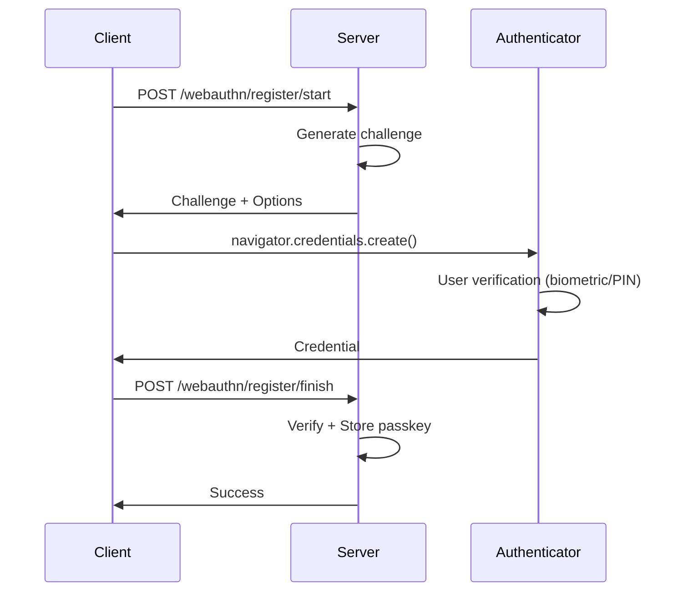

# services/webauthn_service.rs

## File Metadata

**File Path**: `crates/auth-core/src/services/webauthn_service.rs`  
**Crate**: `auth-core`  
**Module**: `services::webauthn_service`  
**Layer**: Domain (Business Logic)  
**Security-Critical**: ✅ **YES** - Passwordless authentication

## Purpose

Provides WebAuthn (Web Authentication) service for passwordless authentication using FIDO2/passkeys, enabling biometric and hardware key authentication.

### Problem It Solves

- Passwordless authentication
- Phishing-resistant authentication
- Hardware security key support
- Biometric authentication (Face ID, Touch ID, Windows Hello)
- Multi-device passkey sync

---

## Detailed Code Breakdown

### Struct: `Passkey`

**Purpose**: Represents a registered passkey/credential

**Methods**:
```rust
pub fn cred_id(&self) -> Uuid
```

---

### Struct: `WebauthnService`

**Purpose**: WebAuthn registration and authentication service

**Fields**:
- `store`: `Arc<dyn WebauthnStore>` - Passkey persistence

---

### Trait: `WebauthnStore`

**Purpose**: Persistence abstraction for passkeys

**Methods**:
```rust
async fn save_passkey(&self, user_id: Uuid, passkey: &Passkey) -> anyhow::Result<()>;
```

---

## Registration Flow

### Method: `start_registration()`

**Signature**: `pub async fn start_registration(&self, user_id: Uuid, username: &str) -> anyhow::Result<(CreationChallengeResponse, RegisterPublicKeyCredentialCreationOptions)>`

**Purpose**: Initiate passkey registration

**Process**:
1. Generate challenge
2. Create credential creation options
3. Return to client for WebAuthn API call

**Client-Side**:
```javascript
// Browser calls WebAuthn API
const credential = await navigator.credentials.create({
    publicKey: options
});
```

---

### Method: `finish_registration()`

**Signature**: `pub async fn finish_registration(&self, user_id: Uuid, challenge: &PasskeyRegistration, response: &RegisterPublicKeyCredential) -> anyhow::Result<()>`

**Purpose**: Complete passkey registration

**Process**:
1. Verify challenge response
2. Validate credential
3. Store passkey
4. Associate with user

---

## Usage Examples

### Example 1: Passkey Registration

```rust
// 1. Start registration
let (challenge, options) = webauthn_service
    .start_registration(user_id, "user@example.com")
    .await?;

// 2. Send options to client
let response = Json(json!({
    "challenge": challenge,
    "options": options
}));

// 3. Client creates credential via WebAuthn API
// 4. Client sends credential back

// 5. Finish registration
webauthn_service
    .finish_registration(user_id, &challenge, &credential)
    .await?;
```

---

### Example 2: Passkey Authentication

```rust
// 1. Start authentication
let (challenge, options) = webauthn_service
    .start_authentication(user_id)
    .await?;

// 2. Client uses WebAuthn API
// const assertion = await navigator.credentials.get({ publicKey: options });

// 3. Verify assertion
let passkey = webauthn_service
    .finish_authentication(user_id, &challenge, &assertion)
    .await?;

// 4. Create session
create_session(user_id).await?;
```

---

## WebAuthn Flow Diagram



---

## Security Considerations

### 1. Challenge Uniqueness

**Requirement**: Each challenge must be unique and single-use

```rust
// Store challenge with expiration
redis.setex(
    format!("webauthn:challenge:{}", challenge_id),
    300, // 5 minutes
    challenge_data
).await?;
```

### 2. Origin Validation

**Requirement**: Verify RP origin matches

```rust
if credential.origin != expected_origin {
    return Err(AuthError::ValidationError {
        message: "Invalid origin".to_string(),
    });
}
```

### 3. Attestation Verification

**Requirement**: Validate authenticator attestation

```rust
// Verify attestation statement
verify_attestation(
    &credential.attestation_object,
    &challenge,
    &rp_id_hash
)?;
```

---

## Production Implementation

### Full WebAuthn Service

```rust
use webauthn_rs::prelude::*;

pub struct ProductionWebauthnService {
    webauthn: Webauthn,
    store: Arc<dyn WebauthnStore>,
}

impl ProductionWebauthnService {
    pub fn new(
        rp_origin: &str,
        rp_id: &str,
        store: Arc<dyn WebauthnStore>,
    ) -> Result<Self> {
        let rp_origin = Url::parse(rp_origin)?;
        let builder = WebauthnBuilder::new(rp_id, &rp_origin)?;
        let webauthn = builder.build()?;
        
        Ok(Self { webauthn, store })
    }
    
    pub async fn start_registration(
        &self,
        user_id: Uuid,
        username: &str,
    ) -> Result<(CreationChallengeResponse, PublicKeyCredentialCreationOptions)> {
        let user_unique_id = user_id.as_bytes().to_vec();
        
        let (ccr, reg_state) = self.webauthn.start_passkey_registration(
            user_unique_id,
            username,
            username,
            None,
        )?;
        
        // Store registration state
        self.store_reg_state(user_id, &reg_state).await?;
        
        Ok((ccr, reg_state.into()))
    }
}
```

---

## Dependencies

### External Crates

| Crate | Purpose |
|-------|---------|
| `uuid` | Identifiers |
| `async-trait` | Async trait support |
| `serde` | Serialization |
| `webauthn-rs` | WebAuthn implementation (production) |

---

## Related Files

- [services/identity.md](file:///c:/Users/Victo/Downloads/sso/docs/code/crates/auth-core/services/identity.md) - Identity service
- [services/credential.md](file:///c:/Users/Victo/Downloads/sso/crates/auth-core/src/services/credential.rs) - Credential service

---

**Document Version**: 1.0  
**Last Updated**: 2026-01-13  
**Lines of Code**: 49  
**Security Level**: CRITICAL
