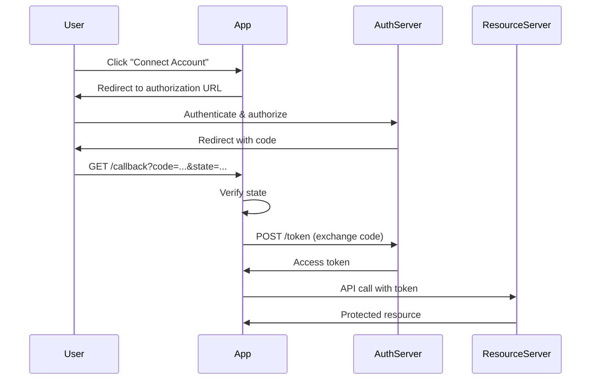

# oauth.rs

## File Metadata

**File Path**: `crates/auth-protocols/src/oauth.rs`  
**Crate**: `auth-protocols`  
**Module**: `oauth`  
**Layer**: Adapter (Protocol)  
**Security-Critical**: ✅ **YES** - OAuth 2.0 authorization

## Purpose

Implements OAuth 2.0 authorization protocol for delegated access, enabling third-party applications to access user resources without exposing credentials.

### Problem It Solves

- Delegated authorization
- Third-party API access
- Social login
- Authorization code flow
- Token exchange

---

## Detailed Code Breakdown

### Struct: `OAuthService`

**Purpose**: OAuth 2.0 client implementation

**Fields**:

| Field | Type | Description |
|-------|------|-------------|
| `client_id` | `String` | OAuth client ID |
| `client_secret` | `String` | OAuth client secret |
| `auth_url` | `String` | Authorization endpoint |
| `token_url` | `String` | Token endpoint |

---

## Methods

### Method: `OAuthService::new()`

**Signature**: `pub fn new(client_id: String, client_secret: String, auth_url: String, token_url: String) -> Self`

**Purpose**: Create OAuth service

---

### Method: `authorize_url()`

**Signature**: `pub fn authorize_url(&self, redirect_uri: &str, state: &str) -> Result<String>`

**Purpose**: Generate authorization URL

**Parameters**:
- `response_type=code` - Authorization code flow
- `client_id` - Application identifier
- `redirect_uri` - Callback URL
- `state` - CSRF protection token
- `scope` - Requested permissions

**Example**:
```rust
let auth_url = oauth_service.authorize_url(
    "https://app.example.com/callback",
    "random-state-token"
)?;

// Returns: https://provider.com/oauth/authorize?
//   response_type=code&
//   client_id=abc123&
//   redirect_uri=https://app.example.com/callback&
//   state=random-state-token&
//   scope=openid+profile+email
```

---

### Method: `exchange_token()`

**Signature**: `pub async fn exchange_token(&self, code: &str, redirect_uri: &str) -> Result<String>`

**Purpose**: Exchange authorization code for access token

**Process**:
```rust
let params = [
    ("grant_type", "authorization_code"),
    ("code", code),
    ("redirect_uri", redirect_uri),
    ("client_id", &self.client_id),
    ("client_secret", &self.client_secret),
];

let response = client.post(&self.token_url)
    .form(&params)
    .send()
    .await?;

let token_response: TokenResponse = response.json().await?;
token_response.access_token
```

---

## OAuth 2.0 Flow

### Authorization Code Flow



---

## Usage Examples

### Example 1: GitHub OAuth

```rust
let oauth_service = OAuthService::new(
    env::var("GITHUB_CLIENT_ID")?,
    env::var("GITHUB_CLIENT_SECRET")?,
    "https://github.com/login/oauth/authorize".to_string(),
    "https://github.com/login/oauth/access_token".to_string(),
);

// Generate authorization URL
let state = generate_random_state();
let auth_url = oauth_service.authorize_url(
    "https://app.example.com/auth/github/callback",
    &state
)?;

// Redirect user
Ok(Redirect::to(&auth_url))
```

---

### Example 2: Token Exchange

```rust
pub async fn github_callback(
    Query(params): Query<CallbackParams>,
    State(state): State<AppState>,
) -> Result<Redirect> {
    // Verify state
    verify_state(&params.state)?;
    
    // Exchange code for token
    let access_token = state.oauth_service.exchange_token(
        &params.code,
        "https://app.example.com/auth/github/callback"
    ).await?;
    
    // Use token to get user info
    let user_info = get_github_user(&access_token).await?;
    
    // Create or update user
    let user = upsert_user_from_github(user_info).await?;
    
    // Create session
    create_session(user.id).await?;
    
    Ok(Redirect::to("/dashboard"))
}
```

---

## Security Considerations

### 1. State Parameter (CSRF Protection)

```rust
// Generate random state
let state = Uuid::new_v4().to_string();
session.insert("oauth_state", &state)?;

// Verify on callback
let stored_state = session.get::<String>("oauth_state")?;
if params.state != stored_state {
    return Err(AuthError::ValidationError {
        message: "State mismatch - CSRF attack".to_string(),
    });
}
```

### 2. HTTPS Only

**Requirement**: All OAuth URLs must use HTTPS

### 3. Client Secret Protection

**Never expose** client secret in client-side code

---

## Dependencies

### External Crates

| Crate | Purpose |
|-------|---------|
| `reqwest` | HTTP client |
| `url` | URL manipulation |
| `anyhow` | Error handling |

---

## Related Files

- [oidc.rs](file:///c:/Users/Victo/Downloads/sso/docs/code/crates/auth-protocols/oidc.md) - OpenID Connect

---

**Document Version**: 1.0  
**Last Updated**: 2026-01-13  
**Lines of Code**: 62  
**Security Level**: CRITICAL
