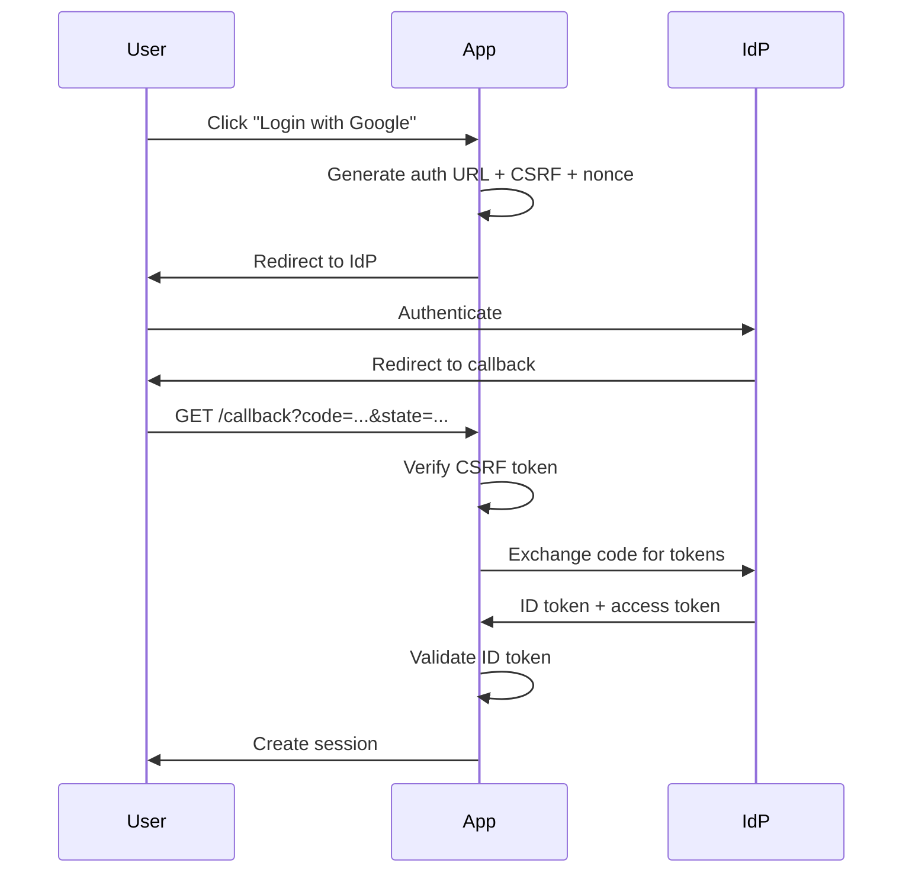

# oidc.rs

## File Metadata

**File Path**: `crates/auth-protocols/src/oidc.rs`  
**Crate**: `auth-protocols`  
**Module**: `oidc`  
**Layer**: Adapter (Protocol)  
**Security-Critical**: ✅ **YES** - OpenID Connect authentication

## Purpose

Implements OpenID Connect (OIDC) protocol for federated authentication, enabling single sign-on with identity providers like Google, Microsoft, Okta, and Auth0.

### Problem It Solves

- Federated authentication
- Social login (Google, Microsoft, GitHub)
- Enterprise SSO integration
- Identity provider discovery
- OAuth 2.0 with identity layer

---

## Detailed Code Breakdown

### Struct: `OidcConfig`

**Purpose**: OIDC client configuration

**Fields**:

| Field | Type | Description |
|-------|------|-------------|
| `issuer_url` | `String` | Identity provider URL |
| `client_id` | `String` | OAuth client ID |
| `client_secret` | `String` | OAuth client secret |
| `redirect_url` | `String` | Callback URL |

---

### Struct: `OidcService`

**Purpose**: OIDC client implementation

**Fields**:
- `client`: `CoreClient` - OpenID Connect client

---

## Methods

### Method: `OidcService::new()`

**Signature**: `pub async fn new(config: OidcConfig) -> Result<Self>`

**Purpose**: Create OIDC service with automatic provider discovery

**Process**:

#### 1. Parse Issuer URL
```rust
let issuer_url = IssuerUrl::new(config.issuer_url.clone())?;
```

#### 2. Discover Provider Metadata
```rust
let provider_metadata = CoreProviderMetadata::discover_async(
    issuer_url,
    async_http_client,
).await?;
```

**Discovery**: Fetches `/.well-known/openid-configuration`

#### 3. Create Client
```rust
let client = CoreClient::from_provider_metadata(
    provider_metadata,
    ClientId::new(config.client_id),
    Some(ClientSecret::new(config.client_secret)),
).set_redirect_uri(RedirectUrl::new(config.redirect_url)?);
```

---

### Method: `new_manual()`

**Signature**: `pub fn new_manual(config: OidcConfig, auth_url: String, token_url: String) -> Result<Self>`

**Purpose**: Create OIDC service with manual endpoint configuration

**Use Case**: When provider doesn't support discovery

---

### Method: `get_authorization_url()`

**Signature**: `pub fn get_authorization_url(&self) -> (String, CsrfToken, Nonce)`

**Purpose**: Generate authorization URL for user redirect

**Returns**:
- Authorization URL
- CSRF token (state parameter)
- Nonce (for ID token validation)

**Process**:
```rust
let (auth_url, csrf_token, nonce) = self.client
    .authorize_url(
        AuthenticationFlow::<CoreResponseType>::AuthorizationCode,
        CsrfToken::new_random,
        Nonce::new_random,
    )
    .add_scope(Scope::new("email".to_string()))
    .add_scope(Scope::new("profile".to_string()))
    .url();
```

**Scopes**:
- `openid` - Required for OIDC
- `email` - Email address
- `profile` - Name, picture, etc.

---

## OIDC Flow

### Authorization Code Flow



---

## Usage Examples

### Example 1: Google Login

```rust
// 1. Configure OIDC
let config = OidcConfig {
    issuer_url: "https://accounts.google.com".to_string(),
    client_id: env::var("GOOGLE_CLIENT_ID")?,
    client_secret: env::var("GOOGLE_CLIENT_SECRET")?,
    redirect_url: "https://app.example.com/auth/google/callback".to_string(),
};

let oidc_service = OidcService::new(config).await?;

// 2. Generate authorization URL
let (auth_url, csrf_token, nonce) = oidc_service.get_authorization_url();

// 3. Store CSRF and nonce in session
session.insert("oauth_csrf", csrf_token.secret())?;
session.insert("oauth_nonce", nonce.secret())?;

// 4. Redirect user
Ok(Redirect::to(&auth_url))
```

---

### Example 2: Callback Handler

```rust
pub async fn google_callback(
    Query(params): Query<CallbackParams>,
    Extension(session): Extension<Session>,
    State(state): State<AppState>,
) -> Result<Redirect> {
    // 1. Verify CSRF token
    let stored_csrf = session.get::<String>("oauth_csrf")?
        .ok_or(AuthError::ValidationError { message: "No CSRF token".to_string() })?;
    
    if params.state != stored_csrf {
        return Err(AuthError::ValidationError {
            message: "CSRF token mismatch".to_string(),
        });
    }
    
    // 2. Exchange authorization code for tokens
    let token_response = state.oidc_service.client
        .exchange_code(AuthorizationCode::new(params.code))
        .request_async(async_http_client)
        .await?;
    
    // 3. Extract ID token
    let id_token = token_response.id_token()
        .ok_or(AuthError::ValidationError { message: "No ID token".to_string() })?;
    
    // 4. Verify ID token
    let stored_nonce = session.get::<String>("oauth_nonce")?;
    let nonce = Nonce::new(stored_nonce);
    
    let claims = id_token.claims(&state.oidc_service.client.id_token_verifier(), &nonce)?;
    
    // 5. Extract user info
    let email = claims.email()
        .ok_or(AuthError::ValidationError { message: "No email".to_string() })?
        .as_str();
    
    let name = claims.name()
        .and_then(|n| n.get(None))
        .map(|n| n.as_str());
    
    // 6. Find or create user
    let user = match user_repo.find_by_email(email).await? {
        Some(user) => user,
        None => {
            // Create new user from OIDC claims
            user_repo.create(CreateUserRequest {
                email: email.to_string(),
                full_name: name.map(String::from),
                email_verified: true, // OIDC provider verified
                ..Default::default()
            }).await?
        }
    };
    
    // 7. Create session
    let session_token = create_session(user.id).await?;
    
    Ok(Redirect::to("/dashboard"))
}
```

---

### Example 3: Microsoft Azure AD

```rust
let config = OidcConfig {
    issuer_url: format!(
        "https://login.microsoftonline.com/{}/v2.0",
        tenant_id
    ),
    client_id: env::var("AZURE_CLIENT_ID")?,
    client_secret: env::var("AZURE_CLIENT_SECRET")?,
    redirect_url: "https://app.example.com/auth/microsoft/callback".to_string(),
};

let oidc_service = OidcService::new(config).await?;
```

---

### Example 4: Okta

```rust
let config = OidcConfig {
    issuer_url: "https://dev-12345.okta.com/oauth2/default".to_string(),
    client_id: env::var("OKTA_CLIENT_ID")?,
    client_secret: env::var("OKTA_CLIENT_SECRET")?,
    redirect_url: "https://app.example.com/auth/okta/callback".to_string(),
};

let oidc_service = OidcService::new(config).await?;
```

---

## ID Token Claims

### Standard Claims

```rust
{
    "iss": "https://accounts.google.com",
    "sub": "110169484474386276334",
    "aud": "your-client-id",
    "exp": 1673456789,
    "iat": 1673453189,
    "nonce": "random-nonce",
    "email": "user@example.com",
    "email_verified": true,
    "name": "John Doe",
    "picture": "https://..."
}
```

---

## Security Considerations

### 1. CSRF Protection

**Requirement**: Validate state parameter

```rust
if params.state != stored_csrf_token {
    return Err(AuthError::ValidationError {
        message: "CSRF attack detected".to_string(),
    });
}
```

### 2. Nonce Validation

**Requirement**: Prevent replay attacks

```rust
let claims = id_token.claims(&verifier, &nonce)?;
```

### 3. ID Token Validation

**Checks**:
- Signature verification (RS256/ES256)
- Issuer validation
- Audience validation
- Expiration check
- Nonce verification

---

## Dependencies

### External Crates

| Crate | Purpose |
|-------|---------|
| `openidconnect` | OIDC client library |
| `reqwest` | HTTP client |
| `anyhow` | Error handling |
| `url` | URL parsing |

---

## Related Files

- [oauth.rs](file:///c:/Users/Victo/Downloads/sso/docs/code/crates/auth-protocols/oauth.md) - OAuth 2.0
- [handlers/auth_oidc.rs](file:///c:/Users/Victo/Downloads/sso/crates/auth-api/src/handlers/auth_oidc.rs) - OIDC handlers

---

**Document Version**: 1.0  
**Last Updated**: 2026-01-13  
**Lines of Code**: 75  
**Security Level**: CRITICAL
