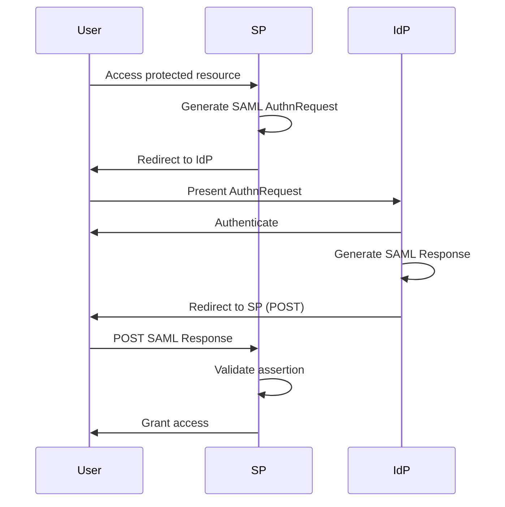

# saml.rs

## File Metadata

**File Path**: `crates/auth-protocols/src/saml.rs`  
**Crate**: `auth-protocols`  
**Module**: `saml`  
**Layer**: Adapter (Protocol)  
**Security-Critical**: ✅ **YES** - SAML authentication

## Purpose

Implements SAML 2.0 (Security Assertion Markup Language) protocol for enterprise single sign-on, enabling federated authentication with corporate identity providers.

### Problem It Solves

- Enterprise SSO
- Corporate identity federation
- SAML-based authentication
- Service Provider (SP) implementation
- Metadata generation

---

## Detailed Code Breakdown

### Struct: `SamlService`

**Purpose**: SAML Service Provider implementation

**Note**: Currently a placeholder stub. Full implementation would use `samael` crate.

---

### Method: `SamlService::new()`

**Signature**: `pub fn new() -> Self`

**Purpose**: Create SAML service

---

### Method: `generate_metadata()`

**Signature**: `pub fn generate_metadata(&self) -> Result<String>`

**Purpose**: Generate SP metadata XML

**Returns**: XML metadata for IdP configuration

**Example Output**:
```xml
<EntityDescriptor entityID="https://sso.example.com/saml/metadata">
  <SPSSODescriptor>
    <AssertionConsumerService 
      Binding="urn:oasis:names:tc:SAML:2.0:bindings:HTTP-POST"
      Location="https://sso.example.com/saml/acs"
      index="0"/>
  </SPSSODescriptor>
</EntityDescriptor>
```

---

## SAML 2.0 Flow

### SP-Initiated SSO



---

## Full Implementation (Production)

### SAML Service with samael

```rust
use samael::metadata::{EntityDescriptor, ContactPerson};
use samael::service_provider::ServiceProvider;

pub struct ProductionSamlService {
    sp: ServiceProvider,
}

impl ProductionSamlService {
    pub fn new(
        entity_id: &str,
        acs_url: &str,
        private_key: &str,
        certificate: &str,
    ) -> Result<Self> {
        let sp = ServiceProvider::new(
            entity_id,
            acs_url,
            private_key,
            certificate,
        )?;
        
        Ok(Self { sp })
    }
    
    pub fn generate_metadata(&self) -> Result<String> {
        let metadata = EntityDescriptor {
            entity_id: self.sp.entity_id.clone(),
            sp_sso_descriptors: vec![self.sp.to_descriptor()],
            ..Default::default()
        };
        
        Ok(metadata.to_xml()?)
    }
    
    pub fn create_authn_request(&self, relay_state: Option<String>) -> Result<String> {
        self.sp.create_authn_request(relay_state)
    }
    
    pub fn validate_response(&self, saml_response: &str) -> Result<Assertion> {
        self.sp.validate_response(saml_response)
    }
}
```

---

## Usage Examples

### Example 1: Generate Metadata

```rust
let saml_service = SamlService::new();
let metadata_xml = saml_service.generate_metadata()?;

// Provide to IdP administrator
println!("{}", metadata_xml);
```

---

### Example 2: Initiate SSO

```rust
pub async fn saml_login(
    State(state): State<AppState>,
) -> Result<Redirect> {
    // Generate SAML AuthnRequest
    let authn_request = state.saml_service.create_authn_request(None)?;
    
    // Encode and redirect to IdP
    let encoded = base64::encode(&authn_request);
    let idp_url = format!(
        "https://idp.example.com/saml/sso?SAMLRequest={}",
        urlencoding::encode(&encoded)
    );
    
    Ok(Redirect::to(&idp_url))
}
```

---

### Example 3: Handle SAML Response

```rust
pub async fn saml_acs(
    Form(params): Form<SamlResponseParams>,
    State(state): State<AppState>,
) -> Result<Redirect> {
    // Decode SAML response
    let saml_response = base64::decode(&params.SAMLResponse)?;
    let saml_xml = String::from_utf8(saml_response)?;
    
    // Validate assertion
    let assertion = state.saml_service.validate_response(&saml_xml)?;
    
    // Extract user attributes
    let email = assertion.get_attribute("email")?;
    let name = assertion.get_attribute("name")?;
    
    // Find or create user
    let user = upsert_user_from_saml(email, name).await?;
    
    // Create session
    create_session(user.id).await?;
    
    Ok(Redirect::to("/dashboard"))
}
```

---

## SAML Assertions

### Example Assertion

```xml
<Assertion>
  <Subject>
    <NameID>user@example.com</NameID>
  </Subject>
  <AttributeStatement>
    <Attribute Name="email">
      <AttributeValue>user@example.com</AttributeValue>
    </Attribute>
    <Attribute Name="firstName">
      <AttributeValue>John</AttributeValue>
    </Attribute>
    <Attribute Name="lastName">
      <AttributeValue>Doe</AttributeValue>
    </Attribute>
  </AttributeStatement>
</Assertion>
```

---

## Security Considerations

### 1. Signature Validation

**Requirement**: Validate XML signature

```rust
sp.validate_signature(&saml_response)?;
```

### 2. Assertion Conditions

**Checks**:
- NotBefore / NotOnOrAfter
- Audience restriction
- Recipient validation

### 3. Replay Prevention

**Store assertion IDs** to prevent reuse

---

## Dependencies

### External Crates

| Crate | Purpose |
|-------|---------|
| `samael` | SAML implementation (production) |
| `base64` | Encoding/decoding |
| `chrono` | Timestamps |

---

## Related Files

- [oidc.rs](file:///c:/Users/Victo/Downloads/sso/docs/code/crates/auth-protocols/oidc.md) - OpenID Connect
- [oauth.rs](file:///c:/Users/Victo/Downloads/sso/docs/code/crates/auth-protocols/oauth.md) - OAuth 2.0

---

**Document Version**: 1.0  
**Last Updated**: 2026-01-13  
**Lines of Code**: 21  
**Security Level**: CRITICAL
