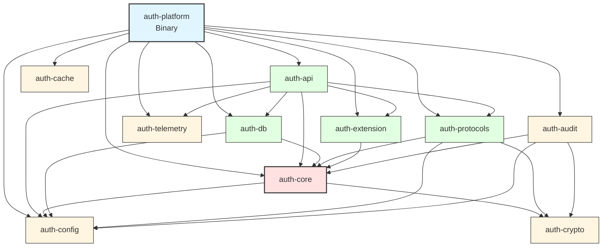

# Dependency & Crate Graph

This document provides comprehensive documentation of all dependencies in the Enterprise SSO Platform, including internal crate dependencies and external library dependencies.

## Internal Dependency Graph



**Legend**:
- **Blue**: Binary crate (application entry point)
- **Red**: Core domain and business logic
- **Green**: Adapters (external interfaces)
- **Yellow**: Infrastructure (cross-cutting concerns)

---

## Internal Dependencies

### Dependency Matrix

| Crate | Depends On |
|-------|------------|
| `auth-platform` | All crates |
| `auth-api` | auth-core, auth-db, auth-config, auth-protocols, auth-extension, auth-telemetry |
| `auth-core` | auth-config, auth-crypto |
| `auth-db` | auth-core, auth-config |
| `auth-protocols` | auth-core, auth-config, auth-crypto |
| `auth-extension` | auth-core |
| `auth-audit` | auth-core, auth-config, auth-crypto |
| `auth-config` | None (foundation) |
| `auth-crypto` | None (foundation) |
| `auth-cache` | None (foundation) |
| `auth-telemetry` | None (foundation) |

### Dependency Rationale

#### auth-core → auth-config
**Reason**: Core services need configuration for:
- Token expiration times
- Password policy rules
- MFA settings
- Risk assessment thresholds

**Alternative Considered**: Dependency injection of config values  
**Why Rejected**: Too verbose, reduces type safety

---

#### auth-core → auth-crypto
**Reason**: Core services need cryptographic operations for:
- Password hashing (Argon2id)
- JWT signing/verification
- Token generation

**Alternative Considered**: Trait-based abstraction  
**Why Chosen**: Already uses traits (`PasswordHasher`, `TokenSigner`)

---

#### auth-api → auth-core
**Reason**: API layer orchestrates business logic services:
- IdentityService for authentication
- AuthorizationService for permission checks
- TokenService for token operations

**Coupling**: Loose (trait-based interfaces)

---

#### auth-api → auth-db
**Reason**: Direct database access for:
- Health checks (database connectivity)
- Performance optimization (avoid service layer overhead)

**Alternative Considered**: All DB access through auth-core  
**Why Rejected**: Unnecessary indirection for simple queries

---

#### auth-db → auth-core
**Reason**: Implements repository traits defined in auth-core:
- `UserStore`
- `TokenStore`
- `SessionStore`

**Pattern**: Repository pattern with trait definitions in core

---

#### auth-protocols → auth-crypto
**Reason**: Protocol implementations need cryptography for:
- SAML signature verification
- OIDC token validation
- OAuth token signing

---

#### auth-audit → auth-crypto
**Reason**: Audit logs need cryptography for:
- Event signing (tamper detection)
- HMAC for integrity verification

---

## External Dependencies

### Core Runtime

#### tokio (v1.35)
**Purpose**: Asynchronous runtime  
**Features**: `full` (all features enabled)  
**Why Chosen**:
- Industry standard for async Rust
- Excellent performance (100k+ concurrent connections)
- Mature ecosystem
- Great debugging tools

**Alternatives Considered**:
- `async-std`: Less ecosystem support
- `smol`: Smaller but less battle-tested

**Used By**: All crates (async operations)

---

### HTTP Server & Client

#### axum (v0.7)
**Purpose**: Web framework  
**Features**: `macros`, `multipart`  
**Why Chosen**:
- Type-safe routing
- Excellent ergonomics
- Built on Tower (middleware ecosystem)
- Compile-time route checking
- Great error messages

**Alternatives Considered**:
- `actix-web`: More mature but less type-safe
- `rocket`: Requires nightly Rust
- `warp`: More complex filter system

**Used By**: auth-api

---

#### tower & tower-http (v0.4, v0.5)
**Purpose**: Middleware abstractions  
**Features**: `full`  
**Why Chosen**:
- Standard middleware interface
- Composable middleware
- Excellent ecosystem

**Used By**: auth-api

---

#### hyper (v1.0)
**Purpose**: HTTP implementation  
**Features**: `full`  
**Why Chosen**:
- Foundation of Axum
- High performance
- HTTP/2 support

**Used By**: auth-api

---

#### reqwest (v0.11)
**Purpose**: HTTP client  
**Features**: `json`, `rustls-tls`  
**Why Chosen**:
- Async-first design
- Easy-to-use API
- TLS support via rustls

**Used By**: auth-protocols (external IdP communication)

---

### Database

#### sqlx (v0.7)
**Purpose**: Async SQL toolkit  
**Features**: `runtime-tokio-rustls`, `mysql`, `sqlite`, `json`, `chrono`, `uuid`  
**Why Chosen**:
- **Compile-time checked queries** (prevents SQL injection)
- Type-safe query results
- Async-first
- Connection pooling
- Migration support

**Alternatives Considered**:
- `diesel`: Synchronous, no compile-time SQL checking
- `sea-orm`: Less mature, more overhead

**Used By**: auth-db, auth-audit

**Example**:
```rust
// Compile-time checked!
sqlx::query_as!(
    User,
    "SELECT * FROM users WHERE email = ? AND tenant_id = ?",
    email,
    tenant_id
)
```

---

#### sea-query (v0.30)
**Purpose**: SQL query builder  
**Why Chosen**:
- Type-safe query construction
- Database-agnostic
- Composable queries

**Used By**: auth-db (complex dynamic queries)

---

### Serialization

#### serde (v1.0)
**Purpose**: Serialization framework  
**Features**: `derive`  
**Why Chosen**:
- Industry standard
- Zero-cost abstractions
- Extensive format support

**Used By**: All crates

---

#### serde_json (v1.0)
**Purpose**: JSON serialization  
**Why Chosen**:
- Fast
- Widely used
- Good error messages

**Used By**: All crates (API requests/responses, config)

---

#### toml (v0.8)
**Purpose**: TOML parsing  
**Why Chosen**:
- Human-readable config format
- Type-safe deserialization

**Used By**: auth-config

---

### Cryptography

#### argon2 (v0.5)
**Purpose**: Password hashing  
**Why Chosen**:
- **OWASP recommended**
- Winner of Password Hashing Competition
- Resistant to GPU/ASIC attacks
- Memory-hard (prevents brute-force)

**Alternatives Considered**:
- `bcrypt`: Older, less secure
- `scrypt`: Less widely adopted

**Used By**: auth-crypto, auth-core

---

#### jsonwebtoken (v9.2)
**Purpose**: JWT operations  
**Why Chosen**:
- Supports RS256 (asymmetric signing)
- Validation helpers
- Good performance

**Used By**: auth-crypto, auth-core

---

#### ring (v0.17)
**Purpose**: Cryptographic primitives  
**Why Chosen**:
- Audited implementation
- High performance
- FIPS-compliant algorithms

**Used By**: auth-crypto

---

#### rustls (v0.22)
**Purpose**: TLS implementation  
**Why Chosen**:
- **Memory-safe** (no OpenSSL vulnerabilities)
- Modern TLS 1.3 support
- No C dependencies

**Alternatives Considered**:
- `native-tls`: Uses OpenSSL (C library, memory unsafe)

**Used By**: Database connections, HTTP client

---

### UUID & Time

#### uuid (v1.6)
**Purpose**: UUID generation  
**Features**: `v4`, `serde`  
**Why Chosen**:
- Standard UUID implementation
- Cryptographically secure UUIDv4

**Used By**: All crates (entity IDs)

---

#### chrono (v0.4)
**Purpose**: Date/time handling  
**Features**: `serde`  
**Why Chosen**:
- Comprehensive date/time operations
- Timezone support
- Serde integration

**Used By**: All crates (timestamps)

---

### Error Handling

#### thiserror (v1.0)
**Purpose**: Error type derivation  
**Why Chosen**:
- Ergonomic error types
- Automatic `Display` implementation
- Error source chaining

**Used By**: All crates

**Example**:
```rust
#[derive(Debug, thiserror::Error)]
pub enum AuthError {
    #[error("Invalid credentials")]
    InvalidCredentials,
    
    #[error("Database error: {0}")]
    DatabaseError(#[from] sqlx::Error),
}
```

---

#### anyhow (v1.0)
**Purpose**: Error handling for applications  
**Why Chosen**:
- Easy error propagation
- Context addition
- Good for binaries (not libraries)

**Used By**: auth-platform (main binary)

---

### Logging & Tracing

#### tracing (v0.1)
**Purpose**: Structured logging  
**Why Chosen**:
- Structured, contextual logging
- Async-aware
- Span-based tracing

**Used By**: All crates

---

#### tracing-subscriber (v0.3)
**Purpose**: Tracing implementation  
**Features**: `env-filter`, `json`  
**Why Chosen**:
- Flexible filtering
- JSON output for production
- Environment-based configuration

**Used By**: auth-platform, auth-telemetry

---

#### tracing-opentelemetry (v0.22)
**Purpose**: OpenTelemetry integration  
**Why Chosen**:
- Distributed tracing
- Industry standard
- Multi-backend support

**Used By**: auth-telemetry

---

### Configuration

#### config (v0.14)
**Purpose**: Configuration management  
**Why Chosen**:
- Multi-source configuration
- Environment variable support
- Type-safe deserialization

**Used By**: auth-config

---

#### dotenvy (v0.15)
**Purpose**: .env file loading  
**Why Chosen**:
- Simple .env parsing
- Development convenience

**Used By**: auth-platform, auth-config

---

### Caching

#### dashmap (v5.5)
**Purpose**: Concurrent hash map  
**Why Chosen**:
- Lock-free reads
- High concurrency
- Drop-in replacement for `HashMap`

**Used By**: auth-cache, auth-config, auth-api (rate limiting)

---

#### redis (v0.24)
**Purpose**: Redis client  
**Features**: `tokio-comp`, `connection-manager`  
**Why Chosen**:
- Async support
- Connection pooling
- Cluster support

**Used By**: auth-cache

---

### Testing

#### proptest (v1.4)
**Purpose**: Property-based testing  
**Why Chosen**:
- Comprehensive test coverage
- Finds edge cases
- Shrinking for minimal failing cases

**Used By**: All crates (dev-dependencies)

**Example**:
```rust
proptest! {
    #[test]
    fn test_password_hash_verify(password in "\\PC{8,128}") {
        let hash = hash_password(&password)?;
        assert!(verify_password(&password, &hash)?);
    }
}
```

---

#### mockall (v0.12)
**Purpose**: Mock generation  
**Why Chosen**:
- Automatic mock generation
- Type-safe mocks
- Expectation verification

**Used By**: auth-core, auth-db (dev-dependencies)

---

### Security

#### secrecy (v0.8)
**Purpose**: Secret handling  
**Features**: `serde`  
**Why Chosen**:
- Prevents accidental logging
- Memory zeroization
- Type-safe secret handling

**Used By**: auth-config, auth-core, auth-db

---

#### constant_time_eq (v0.3)
**Purpose**: Constant-time comparison  
**Why Chosen**:
- Prevents timing attacks
- Critical for password/token comparison

**Used By**: auth-crypto

---

### Validation

#### validator (v0.18)
**Purpose**: Input validation  
**Features**: `derive`  
**Why Chosen**:
- Declarative validation rules
- Email, URL, length validation
- Custom validators

**Used By**: auth-core, auth-api

**Example**:
```rust
#[derive(Validate)]
pub struct CreateUserRequest {
    #[validate(email)]
    pub email: String,
    
    #[validate(length(min = 8, max = 128))]
    pub password: String,
}
```

---

### Metrics & Observability

#### prometheus (v0.13)
**Purpose**: Metrics collection  
**Why Chosen**:
- Industry standard
- Pull-based metrics
- Rich query language (PromQL)

**Used By**: auth-telemetry

---

#### opentelemetry (v0.21)
**Purpose**: Observability framework  
**Features**: `metrics`  
**Why Chosen**:
- Vendor-neutral
- Distributed tracing
- Metrics and logs

**Used By**: auth-telemetry

---

### Protocol Support

#### openidconnect (v3.4)
**Purpose**: OpenID Connect implementation  
**Why Chosen**:
- Complete OIDC implementation
- Type-safe
- Well-maintained

**Used By**: auth-protocols

---

#### samael (v0.0.19)
**Purpose**: SAML implementation  
**Why Chosen**:
- Pure Rust SAML
- No C dependencies

**Alternatives Considered**:
- `saml2-aws`: Less maintained

**Used By**: auth-protocols (commented out, not yet integrated)

---

#### webauthn-rs (v0.5)
**Purpose**: WebAuthn implementation  
**Why Chosen**:
- Complete WebAuthn support
- Hardware security key support
- Biometric authentication

**Used By**: auth-core

---

### Extension Support

#### async-graphql (v7.0)
**Purpose**: GraphQL server  
**Features**: `uuid`, `chrono`  
**Why Chosen**:
- Async-first
- Type-safe schema
- Subscription support

**Used By**: auth-extension

---

#### async-graphql-axum (v7.0)
**Purpose**: GraphQL-Axum integration  
**Why Chosen**:
- Seamless Axum integration
- Middleware support

**Used By**: auth-extension

---

#### rhai (v1.16)
**Purpose**: Embedded scripting  
**Why Chosen**:
- Rust-like syntax
- Sandboxed execution
- Type-safe API

**Used By**: auth-extension

---

### Utilities

#### once_cell (v1.19)
**Purpose**: Lazy static initialization  
**Why Chosen**:
- Thread-safe lazy statics
- No macros needed

**Used By**: auth-api, auth-config

---

#### parking_lot (v0.12)
**Purpose**: Efficient synchronization primitives  
**Why Chosen**:
- Faster than std::sync
- Smaller memory footprint
- Deadlock detection

**Used By**: auth-config, auth-core

---

#### futures (v0.3)
**Purpose**: Async utilities  
**Why Chosen**:
- Stream combinators
- Async trait helpers

**Used By**: auth-core

---

#### async-trait (v0.1)
**Purpose**: Async trait support  
**Why Chosen**:
- Enables async methods in traits
- Required until native async trait support

**Used By**: All crates with async traits

---

## Dependency Statistics

### Total Dependencies

- **Workspace Dependencies**: 40+ shared dependencies
- **Crate-Specific Dependencies**: 10+ per crate
- **Dev Dependencies**: 5+ per crate

### Dependency Categories

| Category | Count | Examples |
|----------|-------|----------|
| Async Runtime | 3 | tokio, tokio-util, futures |
| HTTP | 5 | axum, tower, hyper, reqwest |
| Database | 2 | sqlx, sea-query |
| Serialization | 3 | serde, serde_json, toml |
| Cryptography | 6 | argon2, jsonwebtoken, ring, rustls |
| Error Handling | 2 | thiserror, anyhow |
| Logging | 3 | tracing, tracing-subscriber, tracing-opentelemetry |
| Testing | 2 | proptest, mockall |
| Security | 3 | secrecy, constant_time_eq, validator |
| Protocols | 3 | openidconnect, samael, webauthn-rs |
| Extensions | 3 | async-graphql, rhai |

---

## Avoided Dependencies

### Why No Diesel?
**Reason**: Synchronous ORM, no compile-time SQL checking  
**Chosen Instead**: SQLx (async, compile-time checked)

### Why No Actix-Web?
**Reason**: Less type-safe than Axum, more complex  
**Chosen Instead**: Axum (type-safe, ergonomic)

### Why No OpenSSL?
**Reason**: C library, memory safety concerns  
**Chosen Instead**: Rustls (pure Rust, memory-safe)

### Why No bcrypt?
**Reason**: Older algorithm, less secure than Argon2  
**Chosen Instead**: Argon2id (OWASP recommended)

---

## Dependency Update Policy

### Security Updates
- **Frequency**: Immediate
- **Process**: Automated Dependabot PRs
- **Testing**: Full test suite + manual verification

### Minor Updates
- **Frequency**: Monthly
- **Process**: Batch updates
- **Testing**: Automated tests

### Major Updates
- **Frequency**: Quarterly
- **Process**: Manual review + migration plan
- **Testing**: Comprehensive testing + staging deployment

---

## License Compliance

All dependencies use permissive licenses:
- **MIT**: Majority of dependencies
- **Apache 2.0**: Some dependencies
- **Dual MIT/Apache 2.0**: Common in Rust ecosystem

**No GPL Dependencies**: Avoids copyleft licensing issues

---

**Document Version**: 1.0  
**Last Updated**: 2026-01-13  
**Total Dependencies**: 50+ external crates  
**Internal Crates**: 11
