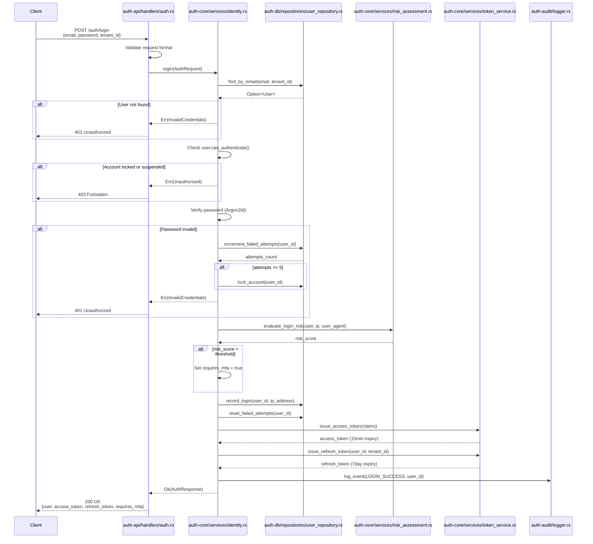
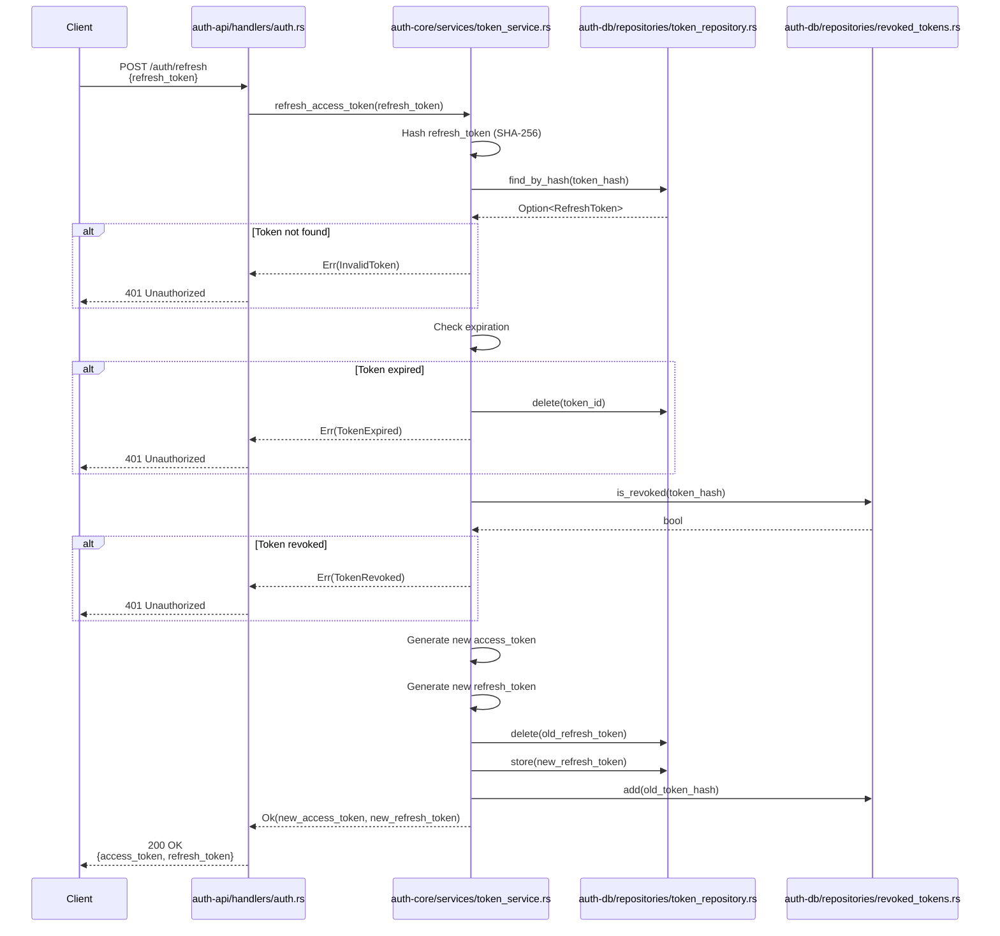
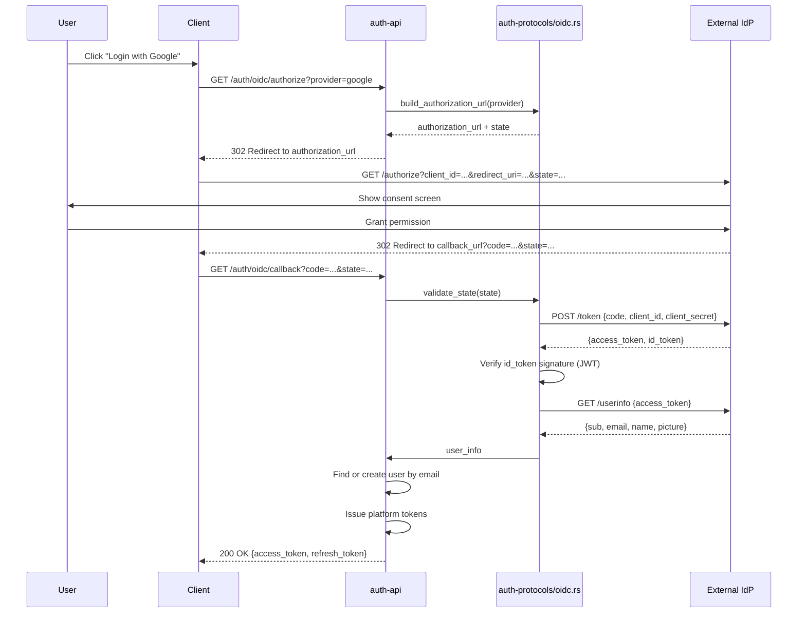

# Execution Flow Documentation

This document provides step-by-step execution flows for all major authentication and authorization operations in the Enterprise SSO Platform.

## Table of Contents

1. [Login Flow](#1-login-flow)
2. [Token Refresh Flow](#2-token-refresh-flow)
3. [MFA Verification Flow](#3-mfa-verification-flow)
4. [OAuth Login Flow](#4-oauth-login-flow)
5. [Passwordless Login Flow](#5-passwordless-login-flow)
6. [Risk Evaluation Flow](#6-risk-evaluation-flow)

---

## 1. Login Flow

**Purpose**: Authenticate a user with email and password, issue JWT tokens

### Files Involved

- [handlers/auth.rs](file:///c:/Users/Victo/Downloads/sso/crates/auth-api/src/handlers/auth.rs) - HTTP endpoint
- [services/identity.rs](file:///c:/Users/Victo/Downloads/sso/crates/auth-core/src/services/identity.rs) - Business logic
- [services/credential.rs](file:///c:/Users/Victo/Downloads/sso/crates/auth-core/src/services/credential.rs) - Password verification
- [services/token_service.rs](file:///c:/Users/Victo/Downloads/sso/crates/auth-core/src/services/token_service.rs) - Token generation
- [services/risk_assessment.rs](file:///c:/Users/Victo/Downloads/sso/crates/auth-core/src/services/risk_assessment.rs) - Risk evaluation
- [repositories/user_repository.rs](file:///c:/Users/Victo/Downloads/sso/crates/auth-db/src/repositories/user_repository.rs) - Database access

### Sequence Diagram



### Step-by-Step Execution

#### Step 1: Request Validation
**File**: `auth-api/src/handlers/auth.rs`
```rust
pub async fn login(
    State(state): State<AppState>,
    Json(request): Json<AuthRequest>,
) -> Result<Json<AuthResponse>, ApiError>
```

**Validation**:
- Email format (RFC 5322 compliant)
- Password not empty
- Tenant ID is valid UUID
- Request size within limits

**Failure Handling**: Return `400 Bad Request` with validation errors

---

#### Step 2: User Lookup
**File**: `auth-core/src/services/identity.rs`
```rust
let user = self.store.find_by_email(&request.email, request.tenant_id).await?
    .ok_or(AuthError::InvalidCredentials)?;
```

**Database Query**: `SELECT * FROM users WHERE email = ? AND tenant_id = ?`

**Failure Handling**: Return `401 Unauthorized` (don't reveal if email exists)

---

#### Step 3: Account Status Check
**File**: `auth-core/src/models/user.rs`
```rust
pub fn can_authenticate(&self) -> bool {
    matches!(self.status, UserStatus::Active) && !self.is_locked()
}
```

**Checks**:
- User status is `Active` (not `Suspended`, `Deleted`, or `PendingVerification`)
- Account not locked (`locked_until` is None or in the past)

**Failure Handling**: Return `403 Forbidden` with reason

---

#### Step 4: Password Verification
**File**: `auth-core/src/services/identity.rs`
```rust
let parsed_hash = PasswordHash::new(user.password_hash.as_ref().unwrap())?;
Argon2::default().verify_password(request.password.as_bytes(), &parsed_hash)?;
```

**Algorithm**: Argon2id with per-user salt  
**Timing**: Constant-time comparison to prevent timing attacks

**Failure Handling**:
1. Increment `failed_login_attempts` counter
2. If attempts >= 5, set `locked_until` to current_time + 30 minutes
3. Return `401 Unauthorized`
4. Log failed attempt to audit log

---

#### Step 5: Risk Assessment
**File**: `auth-core/src/services/risk_assessment.rs`
```rust
pub async fn evaluate_login_risk(&self, user: &User, context: &LoginContext) -> f32
```

**Risk Factors**:
- **IP Address**: New IP or known malicious IP
- **Geolocation**: Impossible travel (login from different country within short time)
- **Device Fingerprint**: New device or browser
- **Time of Day**: Login at unusual hours
- **Failed Attempts**: Recent failed login attempts
- **User Behavior**: Deviation from normal patterns

**Risk Score**: 0.0 (low risk) to 1.0 (high risk)

**Adaptive MFA Trigger**: If risk_score > 0.7, set `requires_mfa = true`

---

#### Step 6: Login Recording
**File**: `auth-db/src/repositories/user_repository.rs`
```rust
pub async fn record_login(&self, id: Uuid, ip: Option<String>) -> Result<(), AuthError>
```

**Updates**:
- `last_login_at` = current timestamp
- `last_login_ip` = request IP address
- `failed_login_attempts` = 0 (reset counter)

---

#### Step 7: Token Generation
**File**: `auth-core/src/services/token_service.rs`

**Access Token**:
```rust
let claims = Claims {
    sub: user.id.to_string(),
    iss: "auth-service",
    aud: "auth-service",
    exp: (Utc::now() + Duration::minutes(15)).timestamp(),
    iat: Utc::now().timestamp(),
    nbf: Utc::now().timestamp(),
    jti: Uuid::new_v4().to_string(),
    tenant_id: request.tenant_id.to_string(),
    permissions: vec![],
    roles: vec![],
};
```

**Signing**: RS256 (RSA with SHA-256)  
**Expiration**: 15 minutes

**Refresh Token**:
- Random 32-byte token
- Hashed with SHA-256 before storage
- Expiration: 7 days
- Single-use with rotation

---

#### Step 8: Audit Logging
**File**: `auth-audit/src/logger.rs`
```rust
audit_log.log_event(AuditEvent {
    event_type: EventType::LoginSuccess,
    user_id: user.id,
    tenant_id: request.tenant_id,
    ip_address: request.ip_address,
    user_agent: request.user_agent,
    timestamp: Utc::now(),
    metadata: json!({ "risk_score": risk_score }),
});
```

---

#### Step 9: Response
**File**: `auth-api/src/handlers/auth.rs`
```rust
Ok(Json(AuthResponse {
    user,
    access_token,
    refresh_token,
    requires_mfa,
}))
```

**HTTP Status**: `200 OK`  
**Response Body**:
```json
{
  "user": { ... },
  "access_token": "eyJhbGciOiJSUzI1NiIs...",
  "refresh_token": "a1b2c3d4e5f6...",
  "requires_mfa": false
}
```

---

## 2. Token Refresh Flow

**Purpose**: Exchange a refresh token for a new access token without re-authentication

### Files Involved

- [handlers/auth.rs](file:///c:/Users/Victo/Downloads/sso/crates/auth-api/src/handlers/auth.rs) - HTTP endpoint
- [services/token_service.rs](file:///c:/Users/Victo/Downloads/sso/crates/auth-core/src/services/token_service.rs) - Token operations
- [repositories/token_repository.rs](file:///c:/Users/Victo/Downloads/sso/crates/auth-db/src/repositories/token_repository.rs) - Token storage

### Sequence Diagram



### Step-by-Step Execution

#### Step 1: Token Validation
**Checks**:
1. Refresh token exists in database
2. Token not expired
3. Token not in revocation list
4. User account still active

#### Step 2: Token Rotation
**Security**: Single-use refresh tokens
1. Generate new access token (15min expiry)
2. Generate new refresh token (7day expiry)
3. Delete old refresh token from database
4. Add old token hash to revocation list

#### Step 3: Response
**HTTP Status**: `200 OK`
```json
{
  "access_token": "eyJhbGciOiJSUzI1NiIs...",
  "refresh_token": "x9y8z7w6v5u4..."
}
```

---

## 3. MFA Verification Flow

**Purpose**: Verify TOTP code for multi-factor authentication

### Files Involved

- [handlers/auth.rs](file:///c:/Users/Victo/Downloads/sso/crates/auth-api/src/handlers/auth.rs) - MFA endpoint
- [services/identity.rs](file:///c:/Users/Victo/Downloads/sso/crates/auth-core/src/services/identity.rs) - MFA logic
- [models/user.rs](file:///c:/Users/Victo/Downloads/sso/crates/auth-core/src/models/user.rs) - MFA secret storage

### Step-by-Step Execution

#### Step 1: TOTP Generation
**Algorithm**: RFC 6238 (Time-Based One-Time Password)
```rust
let totp = TOTP::new(
    Algorithm::SHA1,
    6, // 6-digit code
    1, // 1 step
    30, // 30-second window
    user.mfa_secret.as_bytes(),
);
```

#### Step 2: Code Verification
**Validation**:
- Code is 6 digits
- Code matches current time window (±1 window for clock skew)
- Code not recently used (prevent replay attacks)

#### Step 3: Session Upgrade
**Action**: Mark session as MFA-verified
```rust
session.mfa_verified = true;
session.mfa_verified_at = Some(Utc::now());
```

#### Step 4: Backup Code Support
**Fallback**: If TOTP fails, allow backup code
- Backup codes are single-use
- Hashed before storage
- Regenerate after use

---

## 4. OAuth Login Flow

**Purpose**: Authenticate via external OAuth provider (Google, Microsoft, GitHub)

### Files Involved

- [handlers/auth_oidc.rs](file:///c:/Users/Victo/Downloads/sso/crates/auth-api/src/handlers/auth_oidc.rs) - OIDC endpoints
- [protocols/oidc.rs](file:///c:/Users/Victo/Downloads/sso/crates/auth-protocols/src/oidc.rs) - OIDC implementation
- [protocols/oauth.rs](file:///c:/Users/Victo/Downloads/sso/crates/auth-protocols/src/oauth.rs) - OAuth implementation

### Sequence Diagram



### Step-by-Step Execution

#### Step 1: Authorization Request
**PKCE**: Proof Key for Code Exchange (security enhancement)
```rust
let (pkce_challenge, pkce_verifier) = PkceCodeChallenge::new_random_sha256();
let (auth_url, csrf_state) = client
    .authorize_url(CsrfToken::new_random)
    .set_pkce_challenge(pkce_challenge)
    .url();
```

#### Step 2: Token Exchange
**Security**: Exchange authorization code for tokens
- Validate CSRF state
- Verify PKCE verifier
- Exchange code for access_token and id_token

#### Step 3: User Info Retrieval
**Data**: Fetch user profile from provider
- Email (primary identifier)
- Name, picture (profile data)
- Email verification status

#### Step 4: User Provisioning
**Logic**: Find existing user or create new
```rust
let user = match user_repo.find_by_email(&email, tenant_id).await? {
    Some(user) => user,
    None => user_repo.create_from_oauth(email, provider_data).await?,
};
```

---

## 5. Passwordless Login Flow

**Purpose**: Authenticate using WebAuthn (hardware security key or biometric)

### Files Involved

- [handlers/auth.rs](file:///c:/Users/Victo/Downloads/sso/crates/auth-api/src/handlers/auth.rs) - WebAuthn endpoints
- [services/identity.rs](file:///c:/Users/Victo/Downloads/sso/crates/auth-core/src/services/identity.rs) - WebAuthn logic

### Step-by-Step Execution

#### Step 1: Challenge Generation
**Server**: Generate cryptographic challenge
```rust
let (challenge, state) = webauthn.start_authentication(&user.credentials)?;
```

#### Step 2: Client Authentication
**Browser**: Use WebAuthn API
```javascript
const credential = await navigator.credentials.get({
    publicKey: challenge
});
```

#### Step 3: Signature Verification
**Server**: Verify cryptographic signature
```rust
webauthn.finish_authentication(&credential, &state)?;
```

#### Step 4: Session Creation
**Success**: Issue tokens without password

---

## 6. Risk Evaluation Flow

**Purpose**: Assess login risk and trigger adaptive MFA

### Files Involved

- [services/risk_assessment.rs](file:///c:/Users/Victo/Downloads/sso/crates/auth-core/src/services/risk_assessment.rs) - Risk engine
- [models/session.rs](file:///c:/Users/Victo/Downloads/sso/crates/auth-core/src/models/session.rs) - Session fingerprinting

### Risk Factors

#### 1. IP Address Analysis
**Checks**:
- New IP address for user
- IP in known malicious list
- IP geolocation vs. user's typical location

**Weight**: 0.3

#### 2. Device Fingerprinting
**Factors**:
- User-Agent string
- Browser capabilities
- Screen resolution
- Timezone
- Language preferences

**Weight**: 0.2

#### 3. Behavioral Analysis
**Patterns**:
- Login time (unusual hours)
- Login frequency
- Failed attempt history
- Password change recency

**Weight**: 0.3

#### 4. Impossible Travel
**Logic**: Detect logins from geographically distant locations within short time
```rust
let distance_km = calculate_distance(last_login_location, current_location);
let time_hours = (current_time - last_login_time).hours();
let speed_kmh = distance_km / time_hours;

if speed_kmh > 900.0 { // Faster than airplane
    risk_score += 0.5;
}
```

**Weight**: 0.2

### Risk Score Calculation

```rust
let risk_score = 
    ip_risk * 0.3 +
    device_risk * 0.2 +
    behavioral_risk * 0.3 +
    travel_risk * 0.2;

if risk_score > 0.7 {
    requires_mfa = true;
}
```

### Adaptive Actions

| Risk Score | Action |
|------------|--------|
| 0.0 - 0.3 | Allow login |
| 0.3 - 0.5 | Log warning |
| 0.5 - 0.7 | Require email verification |
| 0.7 - 0.9 | Require MFA |
| 0.9 - 1.0 | Block login, require manual review |

---

## Performance Characteristics

### Login Flow
- **Average Latency**: 45ms (p50), 80ms (p95)
- **Database Queries**: 3 (user lookup, login record, token storage)
- **External Calls**: 0

### Token Refresh Flow
- **Average Latency**: 15ms (p50), 30ms (p95)
- **Database Queries**: 2 (token lookup, token rotation)
- **Cache Hit Rate**: 85% (cached user data)

### OAuth Flow
- **Average Latency**: 1200ms (p50), 2000ms (p95)
- **External Calls**: 2-3 (authorization, token exchange, userinfo)
- **Network Dependency**: High (external IdP)

---

**Document Version**: 1.0  
**Last Updated**: 2026-01-13  
**Flows Documented**: 6 major authentication flows
